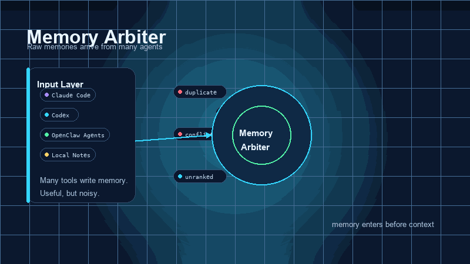

mcp-name: io.github.billy12151/memory-arbiter-mcp

# memory-arbiter-mcp

<p align="center"></p>

**[中文](#中文) | [English](#english)**

---

<a id="english"></a>

## English

A shared memory layer for AI coding tools. One local SQLite database — every tool you use (Cursor, Claude Code, Codex, ZCode, …) searches the same verified facts instead of re-loading markdown files every turn.

```
# Instead of dumping 20K tokens of MEMORY.md into every prompt:
memory_search("auth migration plan")  → 3 laser-relevant entries, ~400 tokens
```

**Less noise, sharper output.** Most AI mistakes aren't the model being dumb — they're the model acting on stale, contradictory, or diluted context. Memory Arbiter fixes the input. Same model, better results.

**Fully local. Zero cloud.** Pure SQLite, no Postgres, no Redis, no API keys. Your data stays on your machine.

### Why Memory Arbiter?

Your AI client loads `MEMORY.md` + `memory/*.md` into the system prompt **every turn**. As knowledge grows, 5K–20K tokens burn before the model even reads your question — and worse, the model drowns in noise, losing track of what's current, what's confirmed, and what's stale.

Memory Arbiter replaces this with a SQLite-backed search: only the relevant entries come back, everything else stays on disk.

**Works with one tool. Scales to many.**

#### Why it works: fix the context, fix the output

| What pollutes AI context | How it degrades output | How Memory Arbiter fixes it |
|---|---|---|
| Key info buried in a 20K-token blob | Model attention is spread thin; it grabs the wrong detail or hallucinates. | `memory_search` returns 3–5 laser-relevant entries. High signal-to-noise. |
| Stale and current info mixed together | Model follows an outdated constraint. | Dual timeline + conflict arbitration: outdated entries are flagged or superseded. |
| "The user confirmed this" vs "the AI guessed this" — indistinguishable | Model treats a guess as ground truth. | `source_type` labels + `user_confirmed` lock. The model knows what to trust. |
| Tool switch = context reset | Each tool re-derives understanding from scratch; errors compound. | Shared memory layer: every tool starts from the same verified facts. |

**Same model. Better context. Better output.** Everything else — token savings, cross-tool sharing, audit trails — flows from this.

Model-agnostic: whether you run GLM, Claude, GPT, or Gemini — the stronger the model, the more sensitive it is to context quality, and the bigger the uplift.

#### Token savings at a glance

Replacing full-file loading with targeted search is the most visible effect. (These are the same gains that section split compounds on long documents — see below.)

| Scenario | Full-file loading | With Memory Arbiter | Saving |
|---|---|---|---|
| Per-turn memory load | 5K–20K tokens in system prompt | 200–800 tokens via `memory_search` | ~80%+ |
| Conflict detection | LLM compares pairs (N², thousands of tokens) | `memory_compare` returns structured verdict (~200 tokens) | ~90% |
| Periodic audit | LLM scans entire library (10K+ tokens) | `memory_list_conflicts` + `memory_audit_summary` serve structured candidates | ~70% |
| Spec handoff (2000 words) | ~3000 tokens loaded into context | ~500 tokens via targeted `memory_search` | ~83% |

> **What it's not:** memory-arbiter is not an LLM and does not do semantic reasoning — that stays with your AI client. It's a structured storage + retrieval + arbitration layer underneath the model.

#### One tool or many: it scales

Even with a single tool (Cursor, Claude Code, Codex, ZCode), Memory Arbiter upgrades your memory from flat markdown to a queryable database: thousands of entries at near-zero retrieval cost, structured conflict detection, source-trust levels, and a full audit trail — instead of manually trimming a growing markdown file.

Using two or more tools adds a shared memory layer: Tool A writes, Tool B searches. No file handoff, no copy-paste, no version drift. One database, zero duplication.

**Real example — a three-tool pipeline** (plan → design → code): OpenClaw writes the spec via `memory_write` → OpenDesign reads it with `memory_search`, produces designs, writes back decisions → ZCode gets spec **and** design decisions in one query. **Zero file handoff across three tools.** A spec+design handoff that used to cost ~5000 tokens of repeated context loading now costs ~800.

> Three concrete usage patterns (per-turn retrieval, scheduled audit, write-time conflict check) and the full cross-tool delegation walkthrough: [`docs/INTEGRATION.md`](docs/INTEGRATION.md).

### Features

- **Targeted retrieval, not full-file loading** — search returns only the relevant entries, cutting per-turn context from 5K–20K tokens to a few hundred.
- **Conflict arbitration** — when two entries contradict, a rule-based engine picks the winner (user-confirmed > document-extracted > AI-generated; newer event time wins ties). Every verdict comes with a human-readable explanation.
- **Trust levels** — "the user confirmed this" and "the AI guessed this" are labeled and ranked differently. User-confirmed facts are locked — no agent can silently overwrite them.
- **Cross-tool sharing** — one SQLite database, every connected tool reads and writes the same memory. No file handoff, no copy-paste, no version drift.
- **Version history** — edit a memory in place; the old version is archived, not lost. Full audit trail of who changed what and when.
- **Long-document section split** — break 10K+ char documents into searchable sections; queries return the matching paragraph, not the whole document.
- **Semantic recall** (optional) — "find by meaning, not just keyword". Bring your own local embedding model (GGUF). Works alongside keyword search.
- **Graceful degradation** — sqlite-vec → FTS5 → LIKE → JSONL backup. Never crashes, even if optional extensions are missing.
- **Health diagnostics** — a one-shot `doctor` check grades config integrity, the vector-enablement chain, split, data consistency, and capacity. Each finding carries a severity and a config-specific fix hint; works as an MCP tool (daily) or a standalone CLI (ambulance: runs even when the MCP process is down). Read-only.
- **Zero cloud, zero LLM calls** — pure local SQLite. No Postgres, Redis, API keys, or external services.

### Quick Start

**Requirements**: Python 3.11+ (3.11, 3.12, or 3.13 — any of them works).

```bash
# Clone
git clone https://github.com/billy12151/memory-arbiter-mcp.git
cd memory-arbiter-mcp

# Setup — use whichever python3.1x you have (>=3.11).
python3.11 -m venv .venv        # or: python3.12 / python3.13
source .venv/bin/activate
pip install -e .                 # installs runtime deps from pyproject.toml

# Optional: semantic recall via sqlite-vec
pip install -e '.[vec]'

# Run
memory-arbiter-mcp
```

#### Zero-install via `uvx` (recommended for non-Python users)

If you just want to run the server without managing a Python env — install [`uv`](https://docs.astral.sh/uv/) once, then:

```bash
uvx --from memory-arbiter-mcp memory-arbiter
```

This pulls the published package and launches the `memory-arbiter` entry point. No venv, no `pip install`. The entry points `memory-arbiter` and `memory-arbiter-mcp` are equivalent — use the shorter one. Note: `uvx` only shortens the **install** step; embedding model and `sqlite-vec` still need separate setup (see [Semantic Recall](#optional-semantic-recall-v050)).

### Connect Your Tool

Add to your tool's MCP config (see `examples/` for ready-made templates). With a local venv:

```json
{
  "mcpServers": {
    "memory-arbiter": {
      "command": "/path/to/memory-arbiter-mcp/.venv/bin/memory-arbiter-mcp",
      "env": {
        "MEMORY_ARBITER_CLIENT": "zcode",
        "MEMORY_ARBITER_AGENT_ID": "zcode-default"
      }
    }
  }
}
```

Or, zero-install via `uvx` (no local clone needed):

```json
{
  "mcpServers": {
    "memory-arbiter": {
      "command": "uvx",
      "args": ["--from", "memory-arbiter-mcp", "memory-arbiter"],
      "env": {
        "MEMORY_ARBITER_CLIENT": "zcode",
        "MEMORY_ARBITER_AGENT_ID": "zcode-default"
      }
    }
  }
}
```

> Change `MEMORY_ARBITER_CLIENT` for each tool (`openclaw`, `zcode`, `codex`, `cursor`, `claude-code`). Put shared paths/vector/model settings in `~/.config/memory-arbiter/config.json`; keep per-client identity in the MCP env block. If you are not using a config file, put `MEMORY_ARBITER_DB_PATH` in each client's env and point them at the same SQLite file. (GUI tools like OpenDesign inherit the host CLI's config — no separate client name.)

> ⚠️ **New session required**: MCP servers are loaded at session startup. Already-open sessions won't see the new tools. Start a fresh session after configuring.

#### 📋 Agent instruction: what to write where

If your client also keeps local markdown (ZCode's `MEMORY.md`, Codex's `AGENTS.md`, etc.), **paste this rule into your agent's system prompt** so it knows what to write where:

```
Local md files store only self-use info (rules, tool experience, config notes,
agent persona). Anything that might be reused by another agent or platform —
not just project info: requirements, research, decisions, progress, user
preferences, knowledge conclusions — goes into memory-arbiter.

Every write must fill: subject, tags, source_type (one of: requirement /
decision / doc_summary / research / progress), event_time (ISO 8601),
workspace (project name), source_ref.

Search via memory_search first; read source files only for detail. When you
find a contradiction, don't overwrite — if you know which is correct, use
memory_supersede (retire the wrong one); if unsure, use memory_arbitrate
(the system decides by timeline + trust level). When a to-do entry is done,
write the status back to the original record (update status/subject to done);
don't just mention "done" in a new memory, or the old entry stays in to-do
state and misleads future searches.
```

### Client Config Locations

| Client | Config Location |
|---|---|
| ZCode | `~/.zcode/v2/` MCP config |
| Codex CLI | `~/.codex/` MCP config |
| Claude Code | `.mcp.json` in project root |
| Cursor | `~/.cursor/mcp.json` |
| OpenClaw | `~/.openclaw/openclaw.json` MCP config |

> **OpenDesign / OpenClaw GUI tools**: these run on top of a host CLI (Codex CLI, Claude Code, etc.) and do **not** have their own MCP config entry. Whatever MCP server the host client has loaded is automatically available — e.g. once Codex CLI configures Memory Arbiter, OpenDesign running on top of Codex can call `memory_search` / `memory_write` natively with no extra setup.

### MCP Tools

Grouped by use case. The first two groups cover daily read/write; the rest are for versioning, long-doc split, semantic ops, and system status.

**Daily read & write** — what most sessions use.

| Tool | Description |
|---|---|
| `memory_write` | Write a memory (`source_type=user_confirmed` auto-locks) |
| `memory_search` | Search memories (FTS5 → LIKE fallback) |
| `memory_get` | Get a single memory by ID. Use when you already know the `memory_id` (e.g. from conflict lists, audit results, or previous search results) to quickly fetch full details without re-running a search. Read-only. |
| `memory_compare` | Compare two memories, returns explanation only |
| `memory_arbitrate` | Arbitrate conflict, can record result (`apply=true`) |
| `memory_confirm` | Promote a memory to user-confirmed and locked |
| `memory_supersede` | Explicitly retire a memory; bypasses user-confirmed/locked protection (`authorized=true` required) |

**Version management** — edit in place without re-creating a record, and audit the change history.

| Tool | Description |
|---|---|
| `memory_edit` | (v0.4.0) In-place edit a memory's content (full or partial `old_text`→`new_text`), archiving the prior version to a history table and re-syncing FTS. `locked`/`user_confirmed` records need `authorized=true`. The right tool for *partial* corrections — `supersede` retires the whole record, which also sinks the parts you didn't mean to negate. |
| `memory_history` | (v0.4.0) View the version chain (historical snapshots) of a memory, newest version first. Read-only. |
| `memory_cleanup_history` | (v0.4.0) Delete historical snapshots from `memory_history` (never touches active records). Per-memory / by-age / full; full cleanup requires `authorized=true`. |

**Long-document section split** (v0.6.0) — paragraph-level retrieval for docs over `split.threshold`. Requires sqlite-vec + GGUF embedding + `split.enabled`.

| Tool | Description |
|---|---|
| `memory_split` | Split a long memory into sections for paragraph-level retrieval. Two-phase: prepare returns the full content for an external LLM to generate section titles/boundaries; publish saves the sections. v0.6.0 is single-batch — for ultra-long documents, pre-chunk before `memory_write` or split across multiple memories. |
| `get_sections` | Get full text + metadata of specific sections by ID. Use after `memory_search` returns `matched_sections` to fetch only the relevant paragraphs. |
| `memory_split_status` | Check a memory's section-split status, section catalog, and global vector index state. |

**Semantic recall ops** — manual embedding control; usually auto-handled once configured.

| Tool | Description |
|---|---|
| `memory_store_embedding` | (optional) Store or replace an embedding manually. v0.5.0+ can also auto-embed writes/searches when configured. |
| `memory_rebuild_embeddings` | (v0.6.0) Batch-rebuild all embeddings after switching embedding models. Processes memory-level + section-level vectors. No LLM needed. |

**System status & audit**

| Tool | Description |
|---|---|
| `memory_status` | Show current mode, degradation status, storage paths |
| `memory_list_conflicts` | List unresolved conflicts |
| `memory_audit_summary` | Per-workspace stats overview (counts, oldest/newest, open conflicts, source_type distribution) |
| `memory_doctor_overview` | Run a read-only health check and return a graded report (18 checks across config / vector chain / split / consistency / capacity). Each finding has a severity and a config-specific `fix_hint`. `deep=true` also loads the GGUF model for a dimension probe. Same engine as the `doctor` CLI below. |

### Optional: Semantic Recall (v0.5.0)

By default, memory-arbiter uses **lexical recall** (FTS5 trigram + BM25 + soft-rerank) — no embedding model, no heavy dependencies, fully local. This is enough for most cases.

For queries where wording differs but meaning is the same ("happy" vs "joyful", "金营平台" vs "金融带货"), you can opt into **semantic recall**. memory-arbiter does **not** bundle an embedding model — you bring your own, so the default install stays lightweight and you keep full control over the model, language, and cost. When configured, normal `memory_write` and `memory_search(query="...")` calls auto-embed; callers do not need to pass `query_embedding` manually.

**Setup (4 steps):**

1. Install sqlite-vec and the GGUF runtime:
   ```bash
   pip install memory-arbiter-mcp[vec]
   pip install llama-cpp-python
   ```
2. Choose an embedding model. For automatic embedding in v0.5.0, the built-in runtime supports local GGUF models:
   - **GGUF (local, recommended)** — works with any GGUF embedding model via `llama-cpp-python`. Reuses models you may already have (e.g. from OpenClaw/llama.cpp). Point the script at the file:
     `embeddinggemma-300m-qat-Q8_0.gguf` is a good 768-dim default.
   - **sentence-transformers (local)** — HuggingFace PyTorch models (`bge-small-zh`, `bge-base-en`, etc.):
     use your own backfill/query script and pass vectors to `memory_store_embedding` / `memory_search(query_embedding=...)`.
   - **Remote API (OpenAI / Zhipu / Tongyi)** — call the API in your own backfill script, pass vectors to `memory_store_embedding`. memory-arbiter only needs `pip install memory-arbiter-mcp[vec]`; no model runtime on this side.

   **Embedding Model Quick Reference** (pick one, then match `MEMORY_ARBITER_VEC_DIM` to its dimension):

   | Path | Recommended model | Dim | Source | Best for |
   |---|---|---|---|---|
   | GGUF (local) | `embeddinggemma-300m-qat-Q8_0.gguf` | 768 | [HuggingFace](https://huggingface.co/google/embeddinggemma-300m-qat) | Reusing a model you already have; no Python ML stack |
   | sentence-transformers | `BAAI/bge-small-zh-v1.5` (CN) / `bge-base-en-v1.5` (EN) | 512 / 768 | [HuggingFace](https://huggingface.co/BAAI) | Best quality-to-size ratio; needs PyTorch |
   | Remote API | `text-embedding-3-small` (OpenAI) / `embedding-3` (Zhipu) | 1536 / 1024 | Provider dashboard | No local compute; per-call cost |

   **End-to-end flow for auto-embedding:** pick GGUF model → put vec/model settings in `~/.config/memory-arbiter/config.json` → restart the MCP server → run `docs/semantic_example.py` once to backfill old memories. New writes and plain-text searches auto-embed after that.
3. Copy the config template and edit paths:
   ```bash
   mkdir -p ~/.config/memory-arbiter
   # Source checkout:
   cp examples/memory-arbiter.config.example.json ~/.config/memory-arbiter/config.json
   # Or pip-installed users:
   curl -L https://raw.githubusercontent.com/billy12151/memory-arbiter-mcp/main/examples/memory-arbiter.config.example.json \
     -o ~/.config/memory-arbiter/config.json
   ```
   Keep shared paths/vector/model settings here instead of each MCP client's env block. Keep `MEMORY_ARBITER_CLIENT` and `MEMORY_ARBITER_AGENT_ID` in each client's env so tools keep separate identities. `~/.config/memory-arbiter/` is user-owned XDG config, so pip installs and client reinstallers do not overwrite it. The first auto-embedding call lazily loads the model and may be noticeably slower; later calls reuse it.
4. Backfill embeddings into existing memories, then search normally:
   ```bash
   # From a source checkout:
   python docs/semantic_example.py                 # backfill all active memories
   python docs/semantic_example.py --query "金营平台营销"   # try a semantic search
   ```
   The backfill helper currently ships as a source-tree script. If you installed only from pip, clone the repo or use `memory_store_embedding` from your own script for existing memories. New writes/edits are auto-embedded once the server is configured.

After configuration, normal `memory_search(query="...")` can generate the query vector automatically. Explicit `query_embedding` still works and takes precedence.

**How it ranks:** semantic candidates get a *floor score* just below content matches — they beat content-only noise but never outrank a real subject/tags hit. The arbitration and trust layer is untouched.

**Measured impact (small sample, not a formal benchmark):** on the same 15 golden queries + 18 pairwise constraints used to validate v0.3.0, enabling semantic recall improved Top-3 hit rate and pairwise ordering. The biggest win was pairwise pass rate reaching 100% — every "should-rank-above" constraint held. SQLite-side latency overhead was ~8ms per query; local embedding generation depends on your model/runtime.

| Metric | bm25 (v0.2.6) | hybrid (v0.3.0) | hybrid + semantic (v0.3.1) |
|---|---|---|---|
| Top-1 hit rate | 46.7% | 53.3% | 53.3% |
| Top-3 hit rate | 60.0% | 66.7% | **73.3%** |
| Pairwise pass rate | 77.8% | 88.9% | **100.0%** |

### Optional: Long-Document Section Split (v0.6.0)

**The problem it solves.** A long document — say a 12000-char design spec or a 4000-char API manual — is stored as one memory. When you search for a specific detail inside it, two things go wrong:

1. **The search can't find the right paragraph.** A memory's semantic vector is built from only the first ~3600 characters of its text. Anything past that — the later chapters, the appendix, the fine print — is invisible to semantic search. Ask about something that only appears in the second half, and the search either misses it entirely or returns the whole document with a vague "this might be relevant".
2. **You get the whole document back.** Even when the search *does* find the right document, it returns all 12000 characters. Your model then has to scan the entire thing to find the 800 characters that actually answer your question — wasting context and attention.

**What section split does.** It breaks a long document into titled sections (like chapters), and gives each section its own search vector. Now when you ask a question, the search can point straight to the right section — and return just that paragraph instead of the whole document.

Think of it as adding a table of contents that search can jump to, instead of always returning the entire book.

**The payoff (measured on this project's own docs — small sample, your mileage may vary):**

We ran 17 queries against 8 long documents (4500–12200 chars), each asking about a specific detail — 10 of them about content that sits past the 3600-char point the old search couldn't see at all. Reproduce with `python scripts/benchmark_section_recall.py` (read-only, runs against your real DB).

*It finds the right paragraph, not just the right document:*

| Metric | Without split | With split |
|---|---|---|
| Correct **paragraph** located (top-1) | — (impossible) | **94%** |
| Correct paragraph located (top-3) | — | **100%** |
| Search finds the document at all | 71% | — |

Without split, even when the document was found, it came back as a fuzzy "distance 14–19" match — search was guessing. With split, the correct paragraph matched at distance 0.23–0.41 — search was confident.

*It returns less text, so your model reads more efficiently:*

| Metric | Without split (full text) | With split (just the matched section) |
|---|---|---|
| Avg text returned per query | ~7350 chars | ~2630 chars |
| **Total across 17 queries** | 124,980 chars | 44,675 chars |
| **Reduction** | | **64%** |

For a 12000-char document both wins stack: the model is pointed to the right ~800-char paragraph *and* never has to scan the other 11000.

**Prerequisites (all required):**
1. Semantic recall configured — sqlite-vec + GGUF embedding (see above)
2. `split.enabled = true` in `config.json`
3. An external LLM to generate section titles and boundaries (only needed for documents without Markdown headings — see below)

> Just switched embedding models? Run `memory_rebuild_embeddings` first — section split stays offline until all vectors match the new model. Check with `memory_status`.

**How it works:**

```
memory_write(long_doc)
  → saves content normally; response includes split_hint if > threshold
  → split_hint is just a suggestion — content is already saved, no data loss

memory_split(memory_id)                    ← prepare, no DB writes
  → returns the full content + section schema
  → Agent sends content to an external LLM → gets back title/summary/anchor
  → (shortcut: if the doc has ≥2 Markdown headings, the parser detects them
     automatically and the agent can build sections from those — no LLM call)

memory_split(memory_id, split_decision="split", sections=[...])
  → arbiter computes section boundaries from the anchors (not from LLM guesses)
  → generates per-section embeddings (all must succeed)
  → saves sections + vectors

memory_search("query")
  → for split documents: section matching finds the relevant paragraphs
  → returns matched_sections (title+summary only), not the full text
  → content is omitted → saves tokens

get_sections(memory_id, [section_id, ...])  ← fetch only the paragraphs you need
memory_get(memory_id)                       ← fetch full text if needed
```

> **Good to know:**
> - **Most docs don't need an LLM.** `memory_split`'s prepare step auto-detects Markdown headings (pure regex). If a document has ≥2 headings, you can build sections directly from the parser result and skip the LLM entirely. The LLM is only needed for unstructured prose with no detectable headings.
> - **Search never degrades.** If the vector index is temporarily unavailable, `memory_search` returns the full text — you lose section precision but search keeps working.
> - **Single-batch limit.** `memory_split(prepare)` returns the whole document at once. If a document exceeds your LLM's context window, pre-chunk it before `memory_write` (store each chunk as its own memory).
> - **Edit clears sections.** `memory_edit` on the content clears all sections and resets split status. Re-run `memory_split` if needed.
> - **Re-calibrate after switching models.** `section_vec_distance_threshold` (default 0.42) is calibrated on embeddinggemma-300m. If you switch embedding models, run `scripts/calibrate_section_threshold.py` and update it — a wrong threshold means no filtering. After switching, also run `memory_rebuild_embeddings` to rebuild all vectors.

**Configuration:** all split settings live in the `config.json` `split` section — see [Configuration](#configuration) for the full table. Here's a complete example:

```json
{
  "db_path": "~/.local/share/memory-arbiter/memory.sqlite3",
  "backup_jsonl": "~/.local/share/memory-arbiter/memory.backup.jsonl",
  "vec": { "enabled": true, "dim": 768 },
  "embedding": {
    "provider": "gguf",
    "model_path": "~/.node-llama-cpp/models/hf_ggml-org_embeddinggemma-300m-qat-Q8_0.gguf",
    "auto_query": true,
    "auto_write": true
  },
  "split": {
    "enabled": true,
    "threshold": 4000,
    "section_vec_distance_threshold": 0.42,
    "section_fulltext_threshold": 0.8,
    "max_sections": 50,
    "max_section_chars": 3600,
    "section_zero_match_preview_chars": 2000
  }
}
```

**When to enable it:** default is **off**. If your memories are mostly short notes, code snippets, or conversation summaries, don't bother — they're retrieved fine by keyword. Section split pays off for long structured documents (design specs, API manuals, research notes). The cost is low: prepare auto-detects Markdown headings (regex, no LLM), and only documents without detectable headings need an LLM call.

### Configuration

Configuration can come from `MEMORY_ARBITER_CONFIG`, then `~/.config/memory-arbiter/config.json`, then environment variables/defaults. **Durable vector/model settings belong in the config file** so they survive MCP client reinstall/migration; each row below shows the JSON path and its env fallback (config file wins when both are set). Environment variables are still useful for simple client identity and CI overrides. Full explanations in [`docs/INTEGRATION.md`](docs/INTEGRATION.md).

**Config file fields** (`~/.config/memory-arbiter/config.json`) — grouped by what they control.

**Storage & access** — where data lives; set once.

| JSON path | Env fallback | Default | What to tune |
|---|---|---|---|
| `db_path` | `MEMORY_ARBITER_DB_PATH` | `./memory_arbiter.sqlite3` | Shared path for cross-tool memory. |
| `backup_jsonl` | `MEMORY_ARBITER_BACKUP_JSONL` | `./memory_arbiter.backup.jsonl` | Append-only JSONL backup, used only when SQLite is read-only. |
| `policy_path` | `MEMORY_ARBITER_POLICY` | _(none)_ | Path to a JSON policy file (per-client enable/disable, agent allow/deny). |

**Search tuning** — knobs to turn when results feel off. `recall_pool_cap` is the first one to try.

| JSON path | Env fallback | Default | What to tune |
|---|---|---|---|
| `recall_pool_cap` | `MEMORY_ARBITER_RECALL_POOL_CAP` | `50` | **Raise to 100–200 when your store exceeds ~100 entries** — first knob to turn if matches go missing. |
| `content_like_cap` | `MEMORY_ARBITER_CONTENT_LIKE_CAP` | `30` | Raise if many same-topic memories exist. |

**Semantic recall** — enables "find by meaning, not just keyword". Requires sqlite-vec + a GGUF model. See [Semantic Recall](#optional-semantic-recall-v050).

| JSON path | Env fallback | Default | What to tune |
|---|---|---|---|
| `vec.enabled` | `MEMORY_ARBITER_ENABLE_SQLITE_VEC` | `false` | Set `true` to enable semantic recall (requires `pip install memory-arbiter-mcp[vec]`). |
| `vec.dim` | `MEMORY_ARBITER_VEC_DIM` | `768` | Must match your embedding model. Changing it requires dropping and recreating `memories_vec`. |
| `embedding.provider` | `MEMORY_ARBITER_EMBEDDING_PROVIDER` | inferred as `gguf` only when `embedding.model_path` is set | Only `gguf` is supported in v0.5.0. Without a model path, auto-embedding stays off. |
| `embedding.model_path` | `MEMORY_ARBITER_EMBEDDING_MODEL_PATH` (or legacy `MEMORY_ARBITER_GGUF`) | _(none)_ | Path to the GGUF embedding model. |
| `embedding.auto_query` | `MEMORY_ARBITER_EMBEDDING_AUTO_QUERY` | `true` | Auto-encode plain-text queries for semantic recall. |
| `embedding.auto_write` | `MEMORY_ARBITER_EMBEDDING_AUTO_WRITE` | `true` | Auto-embed new writes/edits so they enter semantic recall immediately. |

**Long-document split** — paragraph-level retrieval for long docs. Requires semantic recall configured. See [Section Split](#optional-long-document-section-split-v060).

| JSON path | Env fallback | Default | What to tune |
|---|---|---|---|
| `split.enabled` | `MEMORY_ARBITER_SPLIT_ENABLED` | `false` | Master switch for section split. |
| `split.threshold` | `MEMORY_ARBITER_SPLIT_THRESHOLD` | `4000` | Min char count to trigger section split. |
| `split.section_vec_distance_threshold` | `MEMORY_ARBITER_SECTION_VEC_DISTANCE_THRESHOLD` | `0.42` | Section Vec cosine distance cutoff. Calibrated on embeddinggemma-300m; re-calibrate if you switch models. |
| `split.section_fulltext_threshold` | `MEMORY_ARBITER_SECTION_FULLTEXT_THRESHOLD` | `0.8` | Return full text when ≥X% of sections match. |
| `split.max_sections` | `MEMORY_ARBITER_MAX_SECTIONS` | `50` | Max sections per memory (min 2). |
| `split.max_section_chars` | `MEMORY_ARBITER_MAX_SECTION_CHARS` | `3600` | Char limit for section embedding input. |
| `split.section_zero_match_preview_chars` | `MEMORY_ARBITER_SECTION_ZERO_MATCH_PREVIEW_CHARS` | `2000` | (v0.6.3) Zero-match preview length cap. Prevents token explosion on long docs. Clamped [100, 10000]. |

**Environment variables** — keep per-client identity in each MCP client's env block. Some fields also have config-file equivalents, but config wins; use env here when the value must differ by client/session.

| Variable | Default | What to tune |
|---|---|---|
| `MEMORY_ARBITER_CLIENT` | `codex` | Per-tool identity (`codex`, `claude-code`, `cursor`, `zcode`, ...). |
| `MEMORY_ARBITER_AGENT_ID` | `default` | Agent identity within a client. |
| `MEMORY_ARBITER_WORKSPACE` | `default` | Record field on each memory. Not used for search filtering (v0.6.2). Kept for future project-level features. |
| `MEMORY_ARBITER_CONFIG` | _(none)_ | Optional path to an alternate JSON config file. If set, memory-arbiter reads that file instead of the default `~/.config/memory-arbiter/config.json`; file values still override other env fallbacks. |
| `MEMORY_ARBITER_RANKING_MODE` | `hybrid` | `hybrid` (default) or `bm25` (legacy). No config-file equivalent. |
| `MEMORY_ARBITER_GGUF` | _(none)_ | Legacy GGUF path fallback; prefer `embedding.model_path` in the config file. |

### Data Migration

Moving to a new machine? Just copy the SQLite file:

```bash
# On the old machine: copy the database to the new one (via scp, USB, etc.)
scp ~/.local/share/memory-arbiter/memory.sqlite3 newmachine:~/.local/share/memory-arbiter/

# On the new machine: reinstall the project (don't copy .venv — rebuild it)
python3.11 -m venv .venv
source .venv/bin/activate
pip install -e .
```

### Doctor: Health Diagnostics (CLI ambulance)

When something feels off — "search stopped working", "did my model switch break recall?", "is the DB silently losing writes?" — run the built-in doctor. It's the ambulance entry: a standalone CLI that opens its own read-only connection, so it works even when the MCP process is down or the DB is read-only.

```bash
memory-arbiter doctor              # colored text report (auto-disables color when piped)
memory-arbiter doctor --json       # machine-readable, same shape as the MCP tool's data
memory-arbiter doctor --deep       # also load the GGUF model for a dimension probe (seconds)
memory-arbiter doctor --db PATH    # diagnose a different DB (disaster recovery)
```

It runs **18 read-only checks** across five dimensions, each with a severity (`info`/`warning`/`critical`) and a fix hint tailored to your current config:

- **Config integrity** — parse warnings, write-probe result, degradation mode (`jsonl_backup` = silently losing data = critical).
- **Vector-enablement chain** — the highest-value check. "Is semantic recall actually on?" is not a boolean; it walks five links (model configured → `vec.enabled` → extension loaded → model usable → auto flags) and short-circuits at the first break, telling you exactly which link is down and how to fix it. Catches the classic "I configured a model but recall still doesn't work" case (usually `vec.enabled=false`).
- **Split, consistency, capacity** — section-split state, orphaned sections/vectors, version-chain breaks, open-conflict buildup, history bloat, DB size.

Exit codes: `0` clean / `1` has warnings / `2` has criticals — usable in scripts and CI. If the DB can't be opened at all, doctor degrades to a single critical report instead of crashing (that's the whole point of an ambulance). The same engine is exposed as the `memory_doctor_overview` MCP tool for in-conversation use; the CLI just trades the MCP runtime state for a slightly less precise static inference (noted in the report).

### Testing

```bash
python3.11 -m pip install -r requirements.txt
python3.11 -m pytest
```

### License

MIT

---

<a id="中文"></a>

## 中文

AI 编码工具的共享记忆层。一个本地 SQLite 数据库——你用的每个工具（Cursor、Claude Code、Codex、ZCode……）搜索同一套已验证的事实，而不是每轮对话重新加载 markdown 文件。

```
# 不用每轮把 2 万 token 的 MEMORY.md 塞进 prompt：
memory_search("认证迁移方案")  → 3 条精准结果，约 400 token
```

**噪声少了，输出更准。** AI 出错，大部分时候不是模型笨，而是它拿到的输入是过时的、自相矛盾的、或者关键信息被噪声淹没了。memory-arbiter 修的是输入端。同一个模型，结果更好。

**完全本地，零云依赖。** 纯 SQLite，不需要 Postgres、Redis、API key。数据留在你机器上。

### 为什么需要 Memory Arbiter？

你的 AI 客户端每轮对话都把 `MEMORY.md` + `memory/*.md` 整个塞进 system prompt。记忆越多，token 消耗越大——模型还没读你的问题，5K–20K token 的上下文已经烧掉了。更要命的是，模型淹没在噪声里，分不清什么是最新的、什么是用户确认的、什么是过时的。

Memory Arbiter 用 SQLite 检索替代全文加载：只有相关的条目返回，其余的留在磁盘上。

**一个工具就能用。多个工具更香。**

#### 为什么有效：修好上下文，输出自然变好

| 污染 AI 上下文的问题 | 导致的执行偏差 | memory-arbiter 怎么修 |
|---|---|---|
| 关键信息埋在 20K token 的大段文本里 | 模型注意力分散，抓错重点或直接编造 | `memory_search` 只返回 3–5 条高度相关的结果，信噪比拉满 |
| 旧信息和新信息混在一起 | 模型照着过时的约束去执行 | 双时间轴 + 冲突仲裁，过时条目被标记或淘汰 |
| "用户确认的"和"AI 猜的"分不清 | 模型把猜测当事实用 | `source_type` 标记来源，`user_confirmed` 自动锁定，模型知道该信什么 |
| 换个工具上下文就丢了 | 每个工具重新理解一遍，理解偏差累积 | 共享记忆层，所有工具从同一套已验证的事实出发 |

**同一个模型，上下文对了，输出就准了。** 其他一切——省 token、跨工具共享、审计追溯——都是这个核心的自然延伸。

模型无关：不管你用 GLM、Claude、GPT 还是 Gemini——模型越强，对上下文质量越敏感，提升越大。

#### Token 节省一览

用精准检索替代全文加载，是最直观的效果。（长文档分段的收益在这个基础上进一步叠加，见下文。）

| 场景 | 全文加载 | 用 memory-arbiter | 节省 |
|---|---|---|---|
| 每轮记忆加载 | system prompt 塞 5K–20K tokens | `memory_search` 返回 200–800 tokens | ~80%+ |
| 冲突检测 | LLM 逐条比对（N²，数千 tokens） | `memory_compare` 返回结构化裁决（~200 tokens） | ~90% |
| 定期审查 | LLM 扫全库（万级 tokens） | `memory_list_conflicts` + `memory_audit_summary` 出结构化候选 | ~70% |
| 规格交接（2000 字） | 加载进 context ~3000 tokens | 精准 `memory_search` ~500 tokens | ~83% |

> **它不是什么：** memory-arbiter 不是 LLM，不做语义推理——那交给你的 AI 客户端。它是模型下面的一层结构化存储 + 检索 + 仲裁。

#### 一个工具或多个工具：都能扩展

即使只用一个工具（Cursor、Claude Code、Codex、ZCode），memory-arbiter 也把你的记忆从扁平 markdown 升级成可查询的数据库：几千条记忆、检索成本接近零、结构化冲突检测、来源可信度分层、完整审计追溯——不用再手动精简越来越大的 markdown 文件。

同时用两个或更多工具时，再加一层共享记忆：工具 A 写、工具 B 搜。零文件传递、零复制粘贴、零版本混乱。一个数据库，零重复。

**真实案例 —— 三工具管线**（规划 → 设计 → 编码）：OpenClaw 调 `memory_write` 写入规格 → OpenDesign 调 `memory_search("项目")` 拿到上下文、做设计、写回决策 → ZCode 一次查询拿到规格**和**设计决策。**三个工具之间零文件传递。** 一份规格+设计交接，传统重复加载上下文约 ~5000 tokens，现在精准检索约 ~800 tokens。

> 三种典型用法（每轮按需检索、定时审查、写入时冲突检测）和完整的跨工具委派步骤见 [`docs/INTEGRATION.md`](docs/INTEGRATION.md)。

### 核心能力

- **精准检索，不加载全文** —— 搜索只返回相关条目，每轮上下文从 5K–20K token 降到几百 token。
- **冲突仲裁** —— 两条记忆矛盾时，规则引擎裁定胜者（用户确认 > 文档提取 > AI 生成；时间相同时取更新的事件）。每个裁决附带人能看懂的理由。
- **可信度分层** —— "用户确认的"和"AI 猜的"有不同标签和权重。用户确认的事实自动锁定，任何 agent 不能偷偷覆盖。
- **跨工具共享** —— 一个 SQLite 数据库，所有接入的工具读写同一份记忆。零文件传递、零复制粘贴、零版本混乱。
- **版本历史** —— 原地编辑记忆，旧版本自动归档不丢失。谁改了什么、什么时候改的，完整可追溯。
- **长文档分段** —— 把万字文档拆成可搜索的段落，查询只返回命中的那段，不返回整篇。
- **语义检索**（可选）—— "按意思找，不只靠关键词"。自带本地 embedding 模型（GGUF），和关键词检索并存。
- **逐级降级** —— sqlite-vec → FTS5 → LIKE → JSONL 备份。即使缺少可选扩展也不会崩。
- **健康体检** —— 一键 `doctor` 给配置完整性、向量化启用链、分段、数据一致性、容量堆积做分级体检。每条诊断带 severity 和针对当前配置的修复指引；既能作为 MCP 工具（日常）在对话里触发，也能作为独立 CLI（救护车：MCP 进程挂了也能连库诊断）。纯只读。
- **零云依赖、零大模型调用** —— 纯本地 SQLite，不需要 Postgres、Redis、API key 或外部服务。

### 快速开始

**要求**：Python 3.11+（3.11、3.12、3.13 均可）。

```bash
# 克隆
git clone https://github.com/billy12151/memory-arbiter-mcp.git
cd memory-arbiter-mcp

# 安装 —— 用你机器上任意一个 3.11 及以上的 python 即可
python3.11 -m venv .venv        # 也可：python3.12 / python3.13
source .venv/bin/activate
pip install -e .                 # 从 pyproject.toml 安装运行时依赖

# 可选：启用语义召回增强（sqlite-vec）
pip install -e '.[vec]'

# 启动
memory-arbiter-mcp
```

#### 用 `uvx` 零安装启动（推荐非 Python 用户）

只想跑起来、不想管 Python 环境——装一次 [`uv`](https://docs.astral.sh/uv/)，然后：

```bash
uvx --from memory-arbiter-mcp memory-arbiter
```

这会拉取已发布的包并启动 `memory-arbiter` 入口。无需 venv、无需 `pip install`。`memory-arbiter` 和 `memory-arbiter-mcp` 两个入口等价，用短的那个即可。注意：`uvx` 只省掉**安装**这一步，embedding 模型和 `sqlite-vec` 仍需单独配置（见 [语义检索](#可选语义检索v050)）。

### 接入工具

在你的工具的 MCP 配置中加入（完整示例见 `examples/` 目录）。用本地 venv：

```json
{
  "mcpServers": {
    "memory-arbiter": {
      "command": "/path/to/memory-arbiter-mcp/.venv/bin/memory-arbiter-mcp",
      "env": {
        "MEMORY_ARBITER_CLIENT": "zcode",
        "MEMORY_ARBITER_AGENT_ID": "zcode-default"
      }
    }
  }
}
```

或用 `uvx` 零安装（无需本地 clone）：

```json
{
  "mcpServers": {
    "memory-arbiter": {
      "command": "uvx",
      "args": ["--from", "memory-arbiter-mcp", "memory-arbiter"],
      "env": {
        "MEMORY_ARBITER_CLIENT": "zcode",
        "MEMORY_ARBITER_AGENT_ID": "zcode-default"
      }
    }
  }
}
```

> 每个工具改一下 `MEMORY_ARBITER_CLIENT` 标识（`openclaw`、`zcode`、`codex`、`cursor`、`claude-code`）。共享路径、向量、模型配置放 `~/.config/memory-arbiter/config.json`；每客户端身份放 MCP env 段。如果不用配置文件，再把 `MEMORY_ARBITER_DB_PATH` 放到每个客户端 env，并指向同一个 SQLite 文件。（OpenDesign 这类 GUI 工具继承宿主 CLI 的配置，不需要单独的 client 名称。）

> ⚠️ **需要新建会话**：MCP Server 在客户端启动时加载，已经打开的会话不会识别新添加的 Server。配置好后请新建一个会话。

#### 📋 Agent 指令：什么该写到哪里

如果你的客户端同时维护本地 markdown（ZCode 的 `MEMORY.md`、Codex 的 `AGENTS.md` 等），**把下面这段贴进你 agent 的系统指令**，让它知道什么该写到哪里：

```
本地 md 只存自用信息（规则/经验/配置/角色）。凡是有可能被其他 agent
或平台复用的信息（不只是项目信息——需求、调研、决策、进展、用户偏好、
知识结论等），一律写入 memory-arbiter。

每次写入必填：subject、tags、source_type（限 requirement / decision /
doc_summary / research / progress）、event_time（ISO 8601）、workspace
（项目名）、source_ref。

查找先 memory_search，细节读源文件。发现矛盾不覆盖：明确知道哪条对时
用 memory_supersede（废弃错的），不确定时用 memory_arbitrate（系统按
时间线和可信度仲裁）。待办处理完成后回写原条目（更新 status/subject
标注已完成），不要只在新记忆里提及，否则旧条目仍呈待办状态会误导检索。
```

### 客户端配置位置

| 客户端 | 配置文件位置 |
|---|---|
| ZCode | `~/.zcode/v2/` 下 MCP 配置 |
| Codex CLI | `~/.codex/` 下 MCP 配置 |
| Claude Code | 项目根目录 `.mcp.json` |
| Cursor | `~/.cursor/mcp.json` |
| OpenClaw | `~/.openclaw/openclaw.json` MCP 配置 |

> **OpenDesign / OpenClaw GUI 类工具**：这类工具寄宿在底层 CLI（Codex CLI、Claude Code 等）之上，**没有自己的 MCP 配置入口**。宿主客户端加载了哪个 MCP Server，GUI 工具就天然能用——例如 Codex CLI 配好了 memory-arbiter，跑在 Codex 上的 OpenDesign 就能直接调用 `memory_search` / `memory_write`，无需额外设置。

### MCP 工具

按使用场景分组。前两组覆盖日常读写；其余用于版本管理、长文档分段、语义检索运维和系统状态。

**日常读写** —— 大多数会话只用到这些。

| 工具 | 说明 |
|---|---|
| `memory_write` | 写入记忆（`source_type=user_confirmed` 自动锁定） |
| `memory_search` | 搜索记忆（FTS5 → LIKE 自动降级） |
| `memory_get` | 通过 ID 直接获取单条记忆的完整信息。当已知 `memory_id`（如从冲突列表、审计结果、搜索结果中获取）时，直接用此工具获取记忆详情，无需重新搜索。只读。 |
| `memory_compare` | 比较两条记忆，只返回解释 |
| `memory_arbitrate` | 仲裁冲突，自动判定胜者（`apply=true` 时落记录） |
| `memory_confirm` | 用户确认某条记忆，锁定保护 |
| `memory_supersede` | 显式废弃某条记忆；可突破 user_confirmed/locked 保护（需 `authorized=true`） |

**版本管理** —— 原地修改而不重建记录，并审计改动历史。

| 工具 | 说明 |
|---|---|
| `memory_edit` | （v0.4.0）原地编辑记忆正文（整体替换 `new_content` 或局部替换 `old_text`→`new_text`），旧版本自动存入历史表并同步 FTS。`locked`/`user_confirmed` 记忆需 `authorized=true`。**部分否定的正确做法**——`supersede` 会整条沉掉（连同你没否定那部分），`edit` 只改你要改的。 |
| `memory_history` | （v0.4.0）查看一条记忆的版本演化轨迹（历史快照，按版本号倒序）。只读。 |
| `memory_cleanup_history` | （v0.4.0）清理历史表快照（**绝不碰活跃记录**）。支持单条 / 按时间 / 全量；全量清理需 `authorized=true`。 |

**长文档分段**（v0.6.0）—— 超过 `split.threshold` 的文档走段落级检索。需 sqlite-vec + GGUF embedding + `split.enabled`。

| 工具 | 说明 |
|---|---|
| `memory_split` | 将长记忆分段，实现段落级检索。两阶段：prepare 返回全文供外部 LLM 生成段落标题/边界；publish 保存段落。v0.6.0 为单批——超长文档请在 memory_write 前自行分块或拆成多条记忆。 |
| `get_sections` | 按 section ID 获取段落完整原文 + 元数据。`memory_search` 返回 `matched_sections` 后，用此工具取相关段落原文，不必拉取整篇文档。 |
| `memory_split_status` | 查看某条记忆的分段状态、段落目录、全局向量索引状态。 |

**语义检索运维** —— 手动控制向量；配置好后通常自动处理。

| 工具 | 说明 |
|---|---|
| `memory_store_embedding` | （可选）手动存入或替换某条记忆的语义向量。v0.5.0+ 配置后也可自动为写入/查询生成向量。 |
| `memory_rebuild_embeddings` | （v0.6.0）切换 embedding 模型后批量重建所有向量（memory 级 + section 级）。不需要 LLM，只重算向量。 |

**系统状态与审计**

| 工具 | 说明 |
|---|---|
| `memory_status` | 查看运行状态、模式、降级原因 |
| `memory_list_conflicts` | 列出未解决的冲突 |
| `memory_audit_summary` | 各 workspace 记忆统计概览（条目数、最旧/最新、open 冲突数、来源分布） |
| `memory_doctor_overview` | 跑一次只读健康体检，返回分级报告（18 项检查，覆盖配置 / 向量链 / 分段 / 一致性 / 容量）。每条诊断带 severity 和针对当前配置的 `fix_hint`。`deep=true` 时额外加载 GGUF 模型做维度探针。与下面的 `doctor` CLI 用同一套引擎。 |

### 可选：语义检索（v0.5.0）

默认情况下，memory-arbiter 用的是**字面检索**（FTS5 trigram + BM25 + 软重排）——不依赖 embedding 模型、不引入重依赖、完全本地。绝大多数场景这就够了。

对于"措辞不同但语义相同"的查询（比如搜"快乐"想命中"开心"、搜"金融带货"想命中"金营平台"），你可以**可选开启语义检索**。memory-arbiter **不内置** embedding 模型——你自己带模型，这样默认安装保持轻量，模型选择、语言、成本完全由你掌控。配置完成后，普通 `memory_write` 和 `memory_search(query="...")` 会自动向量化，调用方不用手动传 `query_embedding`。

**四步开启：**

1. 安装 sqlite-vec 和 GGUF 运行时：
   ```bash
   pip install memory-arbiter-mcp[vec]
   pip install llama-cpp-python
   ```
2. 选一个 embedding 模型。v0.5.0 的自动向量化内置支持本地 GGUF：
   - **GGUF（本地，推荐）**——通过 `llama-cpp-python` 跑任意 GGUF embedding 模型。能复用你已有的模型（比如 OpenClaw/llama.cpp 用的）。把脚本指到模型文件：
     `embeddinggemma-300m-qat-Q8_0.gguf` 是一个 768 维的默认选择。
   - **sentence-transformers（本地）**——HuggingFace PyTorch 模型（`bge-small-zh`、`bge-base-en` 等）：
     用你自己的 backfill/query 脚本，把向量传给 `memory_store_embedding` / `memory_search(query_embedding=...)`。
   - **远程 API（OpenAI / 智谱 / 通义）**——在你自己的灌向量脚本里调 API，把向量传给 `memory_store_embedding`。memory-arbiter 这侧只需 `pip install memory-arbiter-mcp[vec]`，不跑任何模型。

   **向量模型速查表**（任选一个，然后把 `MEMORY_ARBITER_VEC_DIM` 设成它的维度）：

   | 方式 | 推荐模型 | 维度 | 来源 | 适用场景 |
   |---|---|---|---|---|
   | GGUF（本地） | `embeddinggemma-300m-qat-Q8_0.gguf` | 768 | [HuggingFace](https://huggingface.co/google/embeddinggemma-300m-qat) | 复用已有模型；不想搭 Python ML 环境 |
   | sentence-transformers | `BAAI/bge-small-zh-v1.5`（中）/ `bge-base-en-v1.5`（英） | 512 / 768 | [HuggingFace](https://huggingface.co/BAAI) | 性价比最高；需要 PyTorch |
   | 远程 API | `text-embedding-3-small`（OpenAI）/ `embedding-3`（智谱） | 1536 / 1024 | 各平台控制台 | 不想本地算力；按调用计费 |

   **自动向量化完整流程一句话**：选 GGUF 模型 → 把 vec/model 配置写到 `~/.config/memory-arbiter/config.json` → 重启 MCP server → 跑一次 `docs/semantic_example.py` 给旧记忆补向量。之后新写入和普通文本查询会自动向量化。
3. 复制配置模板并修改路径：
   ```bash
   mkdir -p ~/.config/memory-arbiter
   # 源码 checkout：
   cp examples/memory-arbiter.config.example.json ~/.config/memory-arbiter/config.json
   # 或 pip 安装用户：
   curl -L https://raw.githubusercontent.com/billy12151/memory-arbiter-mcp/main/examples/memory-arbiter.config.example.json \
     -o ~/.config/memory-arbiter/config.json
   ```
   共享路径、向量、模型配置建议放这里，不放每个 MCP 客户端的 env 段。`MEMORY_ARBITER_CLIENT`、`MEMORY_ARBITER_AGENT_ID` 仍放各客户端 env，避免所有工具被全局 config 覆盖成同一个身份。`~/.config/memory-arbiter/` 是用户自己的 XDG 配置目录，pip 安装和客户端重装不会覆盖。第一次自动向量化会懒加载模型，可能明显慢一次；后续复用已加载模型。
4. 给现有记忆补向量，然后正常搜索：
   ```bash
   # 从源码 checkout 运行：
   python docs/semantic_example.py                 # 给所有活跃记忆补向量
   python docs/semantic_example.py --query "金营平台营销"   # 试一次语义检索
   ```
   backfill 辅助脚本目前是源码树脚本。只通过 pip 安装的用户，可以 clone 仓库后运行脚本，或用自己的脚本调用 `memory_store_embedding` 给旧记忆补向量。服务配置好后，新写入/编辑会自动写向量。

配置完成后，普通 `memory_search(query="...")` 可以自动生成查询向量。显式 `query_embedding` 仍然支持，并且优先级更高。

**排序规则**：语义召回的候选会给一个*保底分*（略低于正文命中分）——它能压过"正文顺带提及"的噪音，但永远不会盖过真正的标题/标签命中。仲裁和可信度分层逻辑完全不动。

**实测效果（小样本，非正式 benchmark）**：在 v0.3.0 验证用的同一套 15 条黄金查询 + 18 条 pairwise 约束上，开启语义检索后 Top-3 命中率和排序质量进一步提升。最大的亮点是 pairwise 通过率冲到 100%——所有"该排前面的都排在前面了"。SQLite 侧查询延迟约多 8ms；本地 embedding 生成耗时取决于模型和运行时。

| 指标 | bm25 (v0.2.6) | hybrid (v0.3.0) | hybrid + 语义 (v0.3.1) |
|---|---|---|---|
| Top-1 命中率 | 46.7% | 53.3% | 53.3% |
| Top-3 命中率 | 60.0% | 66.7% | **73.3%** |
| Pairwise 通过率 | 77.8% | 88.9% | **100.0%** |

### 可选：长文分段检索（v0.6.0）

**它解决什么问题。** 一篇长文档——比如 12000 字的设计方案、4000 字的接口手册——作为一条记忆存进去后，你要找里面的某个具体细节时，有两个问题：

1. **搜不到对的段落。** 一条记忆的语义向量只从前 ~3600 个字符生成。超过这个位置的内容——后面的章节、附录、补充说明——语义检索根本"看不见"。问一个只在后半段出现的东西，检索要么完全漏掉，要么含糊地返回整篇文档说"这个可能有关系"。
2. **整篇文档都塞给你。** 就算检索确实找到了对的文档，它返回的是全部 12000 个字符。你的模型得把整篇扫一遍，才能找到真正回答问题的那 800 字——浪费上下文、分散注意力。

**分段做了什么。** 它把长文档拆成带标题的段落（像书的章节），每个段落有自己的检索向量。这样你提问时，检索能直接指到对的那一段，并且只返回那一段，而不是整篇文档。

可以理解为给文档加了一张目录，检索能直接跳到对应章节，而不用每次都把整本书搬出来。

**实测收益（在本项目自己的文档上测的——样本小，仅供参考）：**

我们跑了 17 个查询，对象是 8 篇长文档（4500–12200 字），每个查询都问一个具体细节——其中 10 个问的是旧检索根本看不见的 3600 字之后的内容。用 `python scripts/benchmark_section_recall.py` 可复现（只读，在你的真实库上跑）。

*找得到对的段落，而不只是对的文章：*

| 指标 | 不分段 | 分段后 |
|---|---|---|
| 定位到**正确段落**（top-1） | —（做不到） | **94%** |
| 定位到正确段落（top-3） | — | **100%** |
| 能找到这篇文章 | 71% | — |

不分段时，即使找到了文档，匹配距离也是 14–19（检索在"猜"）。分段后，正确段落的匹配距离是 0.23–0.41（检索很有把握）。

*返回更少的文字，模型读得更高效：*

| 指标 | 不分段（返回全文） | 分段后（只返回命中的段落） |
|---|---|---|
| 每次查询平均返回 | ~7350 字 | ~2630 字 |
| **17 次查询合计** | 124,980 字 | 44,675 字 |
| **减少** | | **64%** |

对一篇 12000 字的文档，两个收益叠加：模型既被指到了对的那 ~800 字，又不用扫其余的 11000 字。

**前置条件（全部满足才能生效）：**
1. 已配置语义检索——sqlite-vec + GGUF embedding（见上方）
2. `config.json` 中 `split.enabled = true`
3. 有外部 LLM 可用于生成段落标题和边界（仅无 Markdown 标题的文档需要，见下）

> 刚换了 embedding 模型？先跑 `memory_rebuild_embeddings`——在所有向量和新模型匹配之前，分段功能保持离线。用 `memory_status` 查看。

**工作流程：**

```
memory_write(长文档)
  → 正常入库；超过阈值时返回 split_hint 建议分段
  → split_hint 只是建议——原文已保存，不丢数据

memory_split(memory_id)                    ← prepare，不写库
  → 返回全文 + section schema
  → Agent 把全文发给外部 LLM → 拿回 title/summary/anchor
  →（捷径：如果文档有 ≥2 个 Markdown 标题，parser 自动检测，
     可以直接用检测结果构建段落，跳过 LLM）

memory_split(memory_id, split_decision="split", sections=[...])
  → arbiter 根据锚点精确计算段落边界（不信 LLM 的猜测）
  → 生成每段向量（必须全部成功）
  → 保存段落 + 向量

memory_search("查询")
  → 对已分段的文档：段落匹配找出相关段落
  → 返回 matched_sections（只有 title+summary），不返回全文
  → content 省略 → 省 token

get_sections(memory_id, [section_id, ...])  ← 只取你需要的段落
memory_get(memory_id)                       ← 需要时取全文
```

> **值得知道的：**
> - **大多数文档不需要 LLM。** `memory_split` 的 prepare 阶段会自动检测 Markdown 标题（纯 regex）。如果文档有 ≥2 个标题，可以直接用检测结果构建段落、完全跳过 LLM。只有没有可检测标题的纯文本文档才需要 LLM。
> - **检索永不退化。** 如果向量索引临时不可用，`memory_search` 直接返回全文——丢的是段落精度，但检索照常工作。
> - **单批限制。** `memory_split(prepare)` 一次性返回整篇文档。如果文档超过你 LLM 的上下文窗口，在 `memory_write` 前先切块（每块存成独立记忆）。
> - **编辑会清空段落。** 对 content 跑 `memory_edit` 会清空所有段落并重置分段状态。需要时重新跑 `memory_split`。
> - **换模型后重新校准。** `section_vec_distance_threshold`（默认 0.42）基于 embeddinggemma-300m 校准。换 embedding 模型后，跑 `scripts/calibrate_section_threshold.py` 更新阈值——阈值不对等于没过滤。换模型后也要跑 `memory_rebuild_embeddings` 重建所有向量。

**配置：** 分段的所有设置都在 `config.json` 的 `split` 段——完整表格见 [配置](#配置)。这里给一个完整示例：

```json
{
  "db_path": "~/.local/share/memory-arbiter/memory.sqlite3",
  "backup_jsonl": "~/.local/share/memory-arbiter/memory.backup.jsonl",
  "vec": { "enabled": true, "dim": 768 },
  "embedding": {
    "provider": "gguf",
    "model_path": "~/.node-llama-cpp/models/hf_ggml-org_embeddinggemma-300m-qat-Q8_0.gguf",
    "auto_query": true,
    "auto_write": true
  },
  "split": {
    "enabled": true,
    "threshold": 4000,
    "section_vec_distance_threshold": 0.42,
    "section_fulltext_threshold": 0.8,
    "max_sections": 50,
    "max_section_chars": 3600,
    "section_zero_match_preview_chars": 2000
  }
}
```

**什么时候开：** 默认**关闭**。如果你的记忆大部分是短笔记、代码片段、对话摘要，不用开——它们靠关键词就能检索到。分段对长结构化文档（设计方案、接口手册、调研笔记）才有收益。成本很低：prepare 自动检测 Markdown 标题（regex，不调 LLM），只有没有可检测标题的文档才需要一次 LLM 调用。

### 配置

配置读取顺序：`MEMORY_ARBITER_CONFIG` 指定文件 → `~/.config/memory-arbiter/config.json` → 环境变量/default。**耐久的向量和模型配置建议放配置文件**，避免 MCP 客户端重装/迁移时丢失；下面每行同时给出 JSON 路径和对应的 env 兜底（两者都设时配置文件优先）。环境变量仍适合简单 client 标识和 CI 覆盖。完整说明见 [`docs/INTEGRATION.md`](docs/INTEGRATION.md)。

**配置文件字段**（`~/.config/memory-arbiter/config.json`）——按用途分组。

**存储与访问** —— 数据放哪；设一次就好。

| JSON 路径 | env 兜底 | 默认值 | 什么时候调 |
|---|---|---|---|
| `db_path` | `MEMORY_ARBITER_DB_PATH` | `./memory_arbiter.sqlite3` | 跨工具共享记忆时设成同一路径。 |
| `backup_jsonl` | `MEMORY_ARBITER_BACKUP_JSONL` | `./memory_arbiter.backup.jsonl` | 追加式 JSONL 备份，仅在 SQLite 只读时启用。 |
| `policy_path` | `MEMORY_ARBITER_POLICY` | _(无)_ | 策略 JSON 文件路径，可按客户端开关、按 agent 允许/拒绝。 |

**检索调优** —— 结果感觉不准时调的旋钮。`recall_pool_cap` 是第一个该试的。

| JSON 路径 | env 兜底 | 默认值 | 什么时候调 |
|---|---|---|---|
| `recall_pool_cap` | `MEMORY_ARBITER_RECALL_POOL_CAP` | `50` | **记忆超过约 100 条时调到 100–200**——发现结果里漏了相关记忆，第一个就调它。 |
| `content_like_cap` | `MEMORY_ARBITER_CONTENT_LIKE_CAP` | `30` | 同主题记忆多时调大。 |

**语义检索** —— 开启"按意思找，不只靠关键词"。需 sqlite-vec + GGUF 模型。详见 [语义检索](#可选语义检索v050)。

| JSON 路径 | env 兜底 | 默认值 | 什么时候调 |
|---|---|---|---|
| `vec.enabled` | `MEMORY_ARBITER_ENABLE_SQLITE_VEC` | `false` | 设 `true` 开启语义检索（需 `pip install memory-arbiter-mcp[vec]`）。 |
| `vec.dim` | `MEMORY_ARBITER_VEC_DIM` | `768` | 必须和你的 embedding 模型一致。改维度要重建 `memories_vec` 表。 |
| `embedding.provider` | `MEMORY_ARBITER_EMBEDDING_PROVIDER` | 仅在设置 `embedding.model_path` 时推断为 `gguf` | v0.5.0 只支持 `gguf`。没有模型路径时，自动向量化保持关闭。 |
| `embedding.model_path` | `MEMORY_ARBITER_EMBEDDING_MODEL_PATH`（或 legacy `MEMORY_ARBITER_GGUF`） | _(无)_ | GGUF embedding 模型路径。 |
| `embedding.auto_query` | `MEMORY_ARBITER_EMBEDDING_AUTO_QUERY` | `true` | 自动 encode 纯文本查询触发语义检索。 |
| `embedding.auto_write` | `MEMORY_ARBITER_EMBEDDING_AUTO_WRITE` | `true` | 新写入/编辑自动灌向量，立即进语义召回。 |

**长文分段** —— 长文档的段落级检索。需语义检索已配置。详见 [长文分段](#可选长文分段检索v060)。

| JSON 路径 | env 兜底 | 默认值 | 什么时候调 |
|---|---|---|---|
| `split.enabled` | `MEMORY_ARBITER_SPLIT_ENABLED` | `false` | 分段总开关。 |
| `split.threshold` | `MEMORY_ARBITER_SPLIT_THRESHOLD` | `4000` | 触发分段的最小字符数。 |
| `split.section_vec_distance_threshold` | `MEMORY_ARBITER_SECTION_VEC_DISTANCE_THRESHOLD` | `0.42` | section Vec 余弦距离上限。基于 embeddinggemma-300m 校准，换模型需重校准。 |
| `split.section_fulltext_threshold` | `MEMORY_ARBITER_SECTION_FULLTEXT_THRESHOLD` | `0.8` | 命中段落占比达到此值时返回全文。 |
| `split.max_sections` | `MEMORY_ARBITER_MAX_SECTIONS` | `50` | 每条记忆最大段数（最小 2）。 |
| `split.max_section_chars` | `MEMORY_ARBITER_MAX_SECTION_CHARS` | `3600` | 段落 embedding 输入字符上限。 |
| `split.section_zero_match_preview_chars` | `MEMORY_ARBITER_SECTION_ZERO_MATCH_PREVIEW_CHARS` | `2000` | （v0.6.3）零段落命中时的预览长度上限。避免长文档 token 爆炸。clamp [100, 10000]。 |

**环境变量**——每客户端身份建议放在各自 MCP env 段。部分字段也有配置文件对应项，但 config 优先；当某个值必须按客户端/会话变化时再放 env。

| 变量 | 默认值 | 什么时候调 |
|---|---|---|
| `MEMORY_ARBITER_CLIENT` | `codex` | 每个工具一个标识（`codex`、`claude-code`、`cursor`、`zcode`…）。 |
| `MEMORY_ARBITER_AGENT_ID` | `default` | 客户端内的 agent 身份。 |
| `MEMORY_ARBITER_WORKSPACE` | `default` | 记忆记录上的字段。v0.6.2 起不再用于搜索过滤，保留供后续项目级功能使用。 |
| `MEMORY_ARBITER_CONFIG` | _(无)_ | 可选：指定另一个 JSON 配置文件路径。设置后读取该文件，而不是默认的 `~/.config/memory-arbiter/config.json`；配置文件里的字段仍然优先于其他 env 兜底值。 |
| `MEMORY_ARBITER_RANKING_MODE` | `hybrid` | `hybrid`（默认）或 `bm25`（legacy）。无配置文件对应。 |
| `MEMORY_ARBITER_GGUF` | _(无)_ | 旧版 GGUF 路径兜底；建议改用配置文件里的 `embedding.model_path`。 |

### 数据迁移

换电脑只需拷贝一个文件：

```bash
# 旧机器：把数据库拷到新机器（scp / U 盘等方式均可）
scp ~/.local/share/memory-arbiter/memory.sqlite3 新机器:~/.local/share/memory-arbiter/

# 新机器：重新安装项目（.venv 不要拷贝，新机器上重建）
python3.11 -m venv .venv
source .venv/bin/activate
pip install -e .
```

### Doctor：健康体检（CLI 救护车）

感觉不对劲——"搜索突然不好用了"、"换模型是不是把召回弄坏了"、"数据库是不是在静默丢写入？"——跑一下内置的 doctor。它是救护车入口：一个独立 CLI，自己开只读连接，所以即使 MCP 进程挂了、或数据库只读，也能诊断。

```bash
memory-arbiter doctor              # 彩色文本报告（管道/重定向时自动关颜色）
memory-arbiter doctor --json       # 机器可读，结构与 MCP 工具的 data 一致
memory-arbiter doctor --deep       # 额外加载 GGUF 模型做维度探针（秒级）
memory-arbiter doctor --db PATH    # 诊断另一个 DB（灾祸恢复）
```

它跑 **18 项只读检查**，分五个维度，每条带 severity（`info`/`warning`/`critical`）和针对你当前配置的修复指引：

- **配置完整性** —— 解析告警、写探针结果、降级模式（`jsonl_backup` = 正在静默丢数据 = critical）。
- **向量化启用链** —— 最高价值的检查。"语义召回到底开没开？"不是布尔值；它走五环链（配置了模型 → `vec.enabled` → 扩展已加载 → 模型可用 → auto 开关），在第一处断裂处短路，明确告诉你哪一环断了、怎么修。专治"我明明配了模型，召回怎么还是不准"（通常是 `vec.enabled=false`）。
- **分段、一致性、容量** —— 分段状态、孤儿分段/向量、版本链断链、open 冲突堆积、历史快照膨胀、DB 容量。

退出码：`0` 正常 / `1` 有 warning / `2` 有 critical —— 可在脚本和 CI 里用。如果数据库根本打不开，doctor 会降级成单条 critical 报告而不是崩溃（这正是救护车的意义）。同一套引擎也作为 `memory_doctor_overview` MCP 工具暴露，供对话内使用；CLI 只是用静态推断替代了 MCP 运行时状态（精度略低，报告里会标注）。

### 测试

```bash
python3.11 -m pip install -r requirements.txt
python3.11 -m pytest
```

### License

MIT
