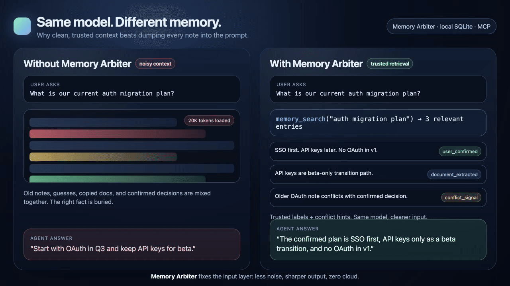

mcp-name: io.github.billy12151/memory-arbiter-mcp

# memory-arbiter-mcp

<p align="center"></p>

**[中文](#中文) | [English](#english)**

---

<a id="english"></a>

## English

**Memory Arbiter is a trustworthy local fact layer for AI agents.**

Chinese name: **迷码**. Short name / CLI alias: **mema**.

It can be used as shared memory, but its real job is fact governance: keeping long-running project context searchable, traceable, source-aware, conflict-aware, and safe to recall.

Shared memory lets every tool see the same data. Memory Arbiter goes further: it helps agents tell which facts are current, user-confirmed, stale, conflicting, superseded, or still waiting for judgment.

```text
# Instead of dumping 20K tokens of MEMORY.md into every prompt:
memory(action="find", data={"query": "auth migration plan"})  → 3 laser-relevant entries, ~400 tokens
```

**Shared memory is the starting point. Fact governance is the moat.**

Fully local by default: one SQLite database, no Postgres, no Redis, no hosted memory service, and no server-side LLM calls. Optional semantic recall uses your own local GGUF embedding model; optional update checks can be disabled.

### The problem

Many memory systems focus on how agents remember. Memory Arbiter focuses on what happens after memory becomes shared.

When Claude Code, Cursor, Codex, ZCode, WorkBuddy, OpenClaw, or other tools all write into the same long-term context, forgetting is no longer the only failure mode. The harder failures are:

- stale facts mixed with current decisions;
- AI guesses treated like user-confirmed truth;
- contradictory conclusions written by different tools;
- long project histories drowning the few facts that matter;
- tool switching causing either context loss or repeated context pollution;
- local memory growing until every prompt starts with thousands of irrelevant tokens.

Memory Arbiter turns those risks into explicit data structures: source labels, confidence, event time, version history, supersede chains, conflict records, structured claim gates, section indexes, workspace boundaries, and doctor diagnostics.

The model still does semantic reasoning. Arbiter keeps the input side cleaner.

### What Memory Arbiter does

| Need | Why ordinary memory is not enough | Memory Arbiter's answer |
|---|---|---|
| Targeted recall | A flat `MEMORY.md` or large vector blob returns too much context. | `memory(action="find")` returns a small set of relevant, ranked entries instead of loading full files. |
| Source trust | User-confirmed facts, document extracts, and AI guesses look the same. | `source_type`, `confidence`, `user_confirmed`, and locked records make trust visible. |
| Time and evolution | Old decisions stay next to new decisions, and the model may follow the stale one. | `event_time`, `ingest_time`, `version`, history (`memory_review`), and supersede (`memory_govern`) preserve the evolution chain. |
| Conflicts | Two memories can disagree and both still be retrieved. | Conflict scan, conflict records, conflict signals, and explicit resolve/supersede tools make disagreement visible. |
| Write-time safety | Last-write-wins silently overwrites or piles up contradictory facts. | v0.9 structured claim gates detect deterministic claim collisions and require host-LLM judgment before use. |
| Long documents | The relevant paragraph is buried inside a 10K+ character memory. | Section split returns the matched sections instead of forcing the model to scan the whole document. |
| Project boundaries | Global memory can leak facts across unrelated projects. | Workspace isolation supports `none`, `weak`, and `strict` modes with alias canonicalization. |
| Long-running health | Users only notice memory problems after bad answers. | `doctor` reports config, vector readiness, split health, consistency, capacity, and conflict buildup. |
| Privacy and ownership | Hosted memory adds another service and another data boundary. | Local SQLite, user-owned files, optional local embeddings, no built-in LLM dependency. |

### Daily mental model

Most agents only need four product tools (the default MCP surface):

1. **`memory`** — daily operations: `remember` new facts, `find` active facts, `read` a memory by ID, `update` an existing current memory, `judge` conflicts, and `status`. Call `action=help` for field examples.
2. **`memory_review`** — read-only inspection: overview, doctor, conflicts, conflict detail, judgments, history, expired memories, audit, and entities.
3. **`memory_govern`** — explicit user-authorized governance: retire a whole memory, resolve a conflict, confirm a memory, or correct a judgment. Not for ordinary updates.
4. **`memory_repair`** — maintenance: section split, rebuild claims/embeddings, cleanup, vector resync, entity backfill, and pending activation. Prefer dry-run first.

Low-level tool implementations remain in the codebase and are reused by the product tools, but their schemas are not exposed by default. Set `MEMORY_ARBITER_TOOL_PROFILE=legacy_full` (or `full`) to expose them alongside the product tools.

### How it differs

Memory Arbiter does not compete by saying that other tools cannot share memory. Shared memory is becoming standard. Memory Arbiter focuses on what shared memory needs next.

| Compared with | Memory Arbiter focuses on |
|---|---|
| Plain markdown memory | Targeted recall instead of full prompt loading, plus history and conflict state. |
| Vector memory | Not just similar recall, but source trust, stale/superseded state, and conflict-aware recall. |
| Graph memory | Not just what is connected, but what is current, trusted, conflicting, or safe to use. |
| Hosted memory | Local SQLite, caller-owned policy, no hosted database, and no server-side LLM calls. |
| Generic MCP memory | A fact-governance layer: trust labels, time evolution, structured claim gates, doctor, and repair tools. |

Graph-like signals exist where they help governance: event time, ingest time, entity/scope, conflict edges, supersede chains, sections, and workspace boundaries. Memory Arbiter treats original facts as the primary asset and derived indexes as support structures.

### Token savings are a side effect

The main value is better context quality. Token savings are the most visible effect.

| Scenario | Full-file loading | With Memory Arbiter | Saving |
|---|---|---|---|
| Per-turn memory load | 5K–20K tokens in system prompt | 200–800 tokens via `memory(action="find")` | ~80%+ |
| Conflict detection | LLM compares pairs with large context | Structured candidates + focused judgment | ~90% |
| Periodic audit | LLM scans the whole library | `memory_review(conflicts)` + `memory_review(audit)` | ~70% |
| Spec handoff | Re-load full spec/design notes | Query the relevant facts and decisions | ~80%+ |

Same model. Better input. Better output.

### Works with one tool. Scales to many.

With one tool, Memory Arbiter upgrades local memory from flat files into a queryable fact layer with trust labels, history, conflict signals, and diagnostics.

With multiple tools, it also becomes shared memory: Tool A writes, Tool B searches, Tool C audits. No file handoff, no copy-paste, no version drift.

Example pipeline:

1. OpenClaw writes a spec with `memory(action="remember")`.
2. OpenDesign reads the spec with `memory(action="find")`, writes back design decisions.
3. ZCode searches once and gets both the spec and design decisions.

Three tools, one local fact layer.

For concrete usage patterns and a cross-tool walkthrough, see [`docs/INTEGRATION.md`](docs/INTEGRATION.md).

### Core capabilities

- **Targeted retrieval** — return the relevant entries instead of loading full memory files every turn.
- **Trust levels** — separate user-confirmed facts, document extracts, AI-generated notes, and unknown sources.
- **Temporal history** — track event time, ingest time, versions, history snapshots, and supersede chains.
- **Conflict arbitration** — discover, record, inspect, resolve, or supersede contradictory memories.
- **Structured claim gates** — v0.9 write/edit-time deterministic claim detection with required host-LLM judgment before use.
- **Long-document section split** — split long memories into searchable sections and return matched paragraphs.
- **Workspace isolation** — choose `none`, `weak`, or `strict` isolation with workspace alias canonicalization.
- **Smart tag ranking and filters** — tags act as discrete ranking/filter labels, not weak text fragments.
- **Semantic recall** — optional local GGUF embeddings for meaning-based recall, while lexical recall remains the default.
- **Doctor diagnostics** — read-only health checks for config, vector readiness, split, claims, consistency, capacity, and conflicts.
- **Graceful degradation** — sqlite-vec → FTS5 → LIKE → JSONL backup, so the server keeps working when optional pieces are unavailable.
- **Local-first storage** — pure SQLite, no hosted database, no Redis/Postgres requirement, no server-side LLM dependency.

> **What it is not:** Memory Arbiter is not an LLM and does not replace your AI client. It is a structured storage, retrieval, arbitration, and diagnostics layer underneath the model.

### Quick Start

**Requirements:** Python 3.11+ (3.11, 3.12, or 3.13).

```bash
# Clone
git clone https://github.com/billy12151/memory-arbiter-mcp.git
cd memory-arbiter-mcp

# Setup — use whichever python3.1x you have (>=3.11)
python3.11 -m venv .venv
source .venv/bin/activate
pip install -e .

# Optional: semantic recall via sqlite-vec
pip install -e '.[vec]'

# Run (short alias)
mema

# Compatible long names still work:
# memory-arbiter
# memory-arbiter-mcp
```

#### Zero-install via `uvx`

If you just want to run the server without managing a Python environment, install [`uv`](https://docs.astral.sh/uv/) once, then:

```bash
uvx --from memory-arbiter-mcp mema
```

This pulls the published package and launches the `mema` entry point. `mema` is the short alias for Memory Arbiter; `memory-arbiter-mcp` and `memory-arbiter` remain compatible long names. `uvx` only shortens the install path; embedding models and sqlite-vec still need separate setup if you want semantic recall.

#### Setup helper

Instead of editing `config.json` by hand, run:

```bash
mema setup
```

The helper writes a working config to `~/.config/memory-arbiter/config.json`, checks your environment, and prints the exact commands or download URLs you still need. It does not run `pip` or download models for you.

Useful flags: `--print-config`, `--no-config`, `--force`.

#### Local Console MVP

Start the read-only local governance Console:

```bash
mema console
```

It opens `http://127.0.0.1:18876` by default. Optional flags:

```bash
mema console --no-open       # start the server without opening a browser
mema console --port 18877    # use a different port when 18876 is busy
```

The Console listens on `127.0.0.1` by default and is local-only in this version. It is a visibility and review surface, not a memory editor: Overview, Conflicts, Conflict Detail, Memories, Doctor, and Settings are read-only. The UI switches between English (`mema Console`) and Chinese (`迷码 Console`); the CLI remains English-only and uses the `mema` alias.

The Support Panel offers GitHub Star, feature request, UX feedback, and bug report shortcuts through prefilled public issue links. It does not upload memory content automatically, does not store GitHub tokens, and does not call GitHub APIs.

Useful boundary: do not expose the Console port publicly. It can display memory content from your local database.

### Connect your tool

Add Memory Arbiter to your MCP config. With a local virtualenv:

```json
{
  "mcpServers": {
    "memory-arbiter": {
      "command": "/path/to/memory-arbiter-mcp/.venv/bin/memory-arbiter-mcp",
      "env": {
        "MEMORY_ARBITER_CLIENT": "zcode",
        "MEMORY_ARBITER_AGENT_ID": "zcode-default"
      }
    }
  }
}
```

Or via `uvx`:

```json
{
  "mcpServers": {
    "memory-arbiter": {
      "command": "uvx",
      "args": ["--from", "memory-arbiter-mcp", "memory-arbiter"],
      "env": {
        "MEMORY_ARBITER_CLIENT": "zcode",
        "MEMORY_ARBITER_AGENT_ID": "zcode-default"
      }
    }
  }
}
```

Change `MEMORY_ARBITER_CLIENT` for each tool (`openclaw`, `zcode`, `codex`, `cursor`, `claude-code`, `workbuddy`, ...). Put shared database, vector, and model settings in `~/.config/memory-arbiter/config.json`; keep per-client identity in the MCP env block.

> **New session required:** MCP servers are loaded at session startup. Already-open sessions will not see newly added tools.

#### Agent onboarding guide

For the compact rule agents should save to their persistent local memory file, see the local [`memory_arbiter/AGENT_ONBOARDING.md`](memory_arbiter/AGENT_ONBOARDING.md) file or the GitHub copy at <https://github.com/billy12151/memory-arbiter-mcp/blob/main/memory_arbiter/AGENT_ONBOARDING.md>. Agents can also read the same guide through `memory(action="help", data={"topic": "agent_onboarding"})`.

### Client config locations

| Client | Config location |
|---|---|
| ZCode | `~/.zcode/v2/` MCP config |
| Codex CLI | `~/.codex/` MCP config |
| Claude Code | `.mcp.json` in project root |
| Cursor | `~/.cursor/mcp.json` |
| WorkBuddy | `~/.workbuddy/mcp.json` |
| OpenClaw | `~/.openclaw/openclaw.json` MCP config |

OpenDesign and OpenClaw GUI tools run on top of a host CLI. They inherit whatever MCP server the host client has loaded.

### MCP tools

v0.11.0 introduces a task-oriented default MCP surface. New clients see four product tools instead of the legacy low-level tool list:

| Tool | Description |
|---|---|
| `memory` | Daily memory operations: remember, find, read, update, submit conflict judgment, and status. Use `action=help` for command-specific fields. |
| `memory_review` | Read-only inspection: overview, doctor, conflicts, conflict detail, judgments, history, expired memories, audit, and entities. |
| `memory_govern` | Explicit user-authorized governance: retire a whole memory, resolve a conflict, confirm a memory, correct a judgment, and govern workspace aliases / pending workspaces. Do not use for ordinary updates. |
| `memory_repair` | Maintenance and repair: split, rebuild claims/embeddings, cleanup, vector resync, entity backfill, and pending activation. Prefer dry-run first. |

Low-level tool implementations remain inside Memory Arbiter and are reused by the product tools, but their schemas are not exposed by default. This keeps ordinary Agent context smaller and makes the daily path easier to choose.

Advanced compatibility: set `MEMORY_ARBITER_TOOL_PROFILE=legacy_full` (or `full`) to expose the legacy low-level MCP tool surface alongside the product tools.


#### Optional: write-time semantic conflict check

Memory Arbiter can optionally run a local Qwen2.5-0.5B model after writes to produce **semantic conflict notices** — lightweight, reviewable hints that a new memory may semantically conflict with an existing one. The model is only a candidate signal, never the final judge: whether a candidate becomes a visible notice is decided by pair-text gates (`medium` by default for balanced recall; `strong` for lower-noise, higher-confidence notices).

Pipeline: metadata-overlap coarse recall (subject + tags) → 0.5B pair classification → pair-text gate → `semantic_notices` row. Notices are viewed and dismissed via `memory_repair(task="notice", ...)`, and runtime control is via `memory_repair(task="semantic_control", ...)`. This is currently the only automated conflict-candidate source: the legacy vector conflict-candidate scan has been removed from the tool surface. `embedding`/`sqlite-vec` remain supported for semantic recall, section recall, and workspace aliasing, but no longer feed a conflict scanner.

The model is **not bundled** with the default PyPI/uvx package. Install the local runtime extra and point it at a GGUF file:

```bash
pip install "memory-arbiter-mcp[semantic-local]"   # pulls llama-cpp-python
```

Then set `semantic_conflict.model_path` (or `MEMORY_ARBITER_SEMANTIC_CONFLICT_MODEL_PATH`) and enable `semantic_conflict.enabled`. The feature is off by default. Processing is local-only; no memory content leaves the machine unless a remote backend is explicitly configured in a future version.

### Optional: Semantic Recall

By default, Memory Arbiter uses lexical recall: FTS5 trigram + BM25 + soft rerank. This is local, lightweight, and enough for many projects.

For meaning-based recall, enable sqlite-vec and bring your own embedding model. The built-in automatic path supports local GGUF models through `llama-cpp-python`; remote embedding APIs can also be used by your own scripts through `memory_repair(task="resync_vectors")` (or the legacy `memory_store_embedding` under `legacy_full`).

```bash
pip install memory-arbiter-mcp[vec]
pip install llama-cpp-python
```

Recommended local model: `embeddinggemma-300m-qat-Q8_0.gguf` (768 dimensions). Configure it in `~/.config/memory-arbiter/config.json`, restart the MCP server, then backfill existing memories with `docs/semantic_example.py` if you are using a source checkout.

Semantic candidates receive a floor score below strong subject/tag matches. They help find meaning-equivalent memories without letting fuzzy vector matches override precise labels.

### Tag scoring and filters

Tags are treated as discrete labels, not as a sentence. A memory tagged `v0.7.2` and `release` should outrank a subject that only incidentally contains one query word.

`memory(action="find")` supports (forwarded to the low-level search):

- `tags_filter`: strict AND over tags;
- `after_time` / `before_time`: ingest-time bounds;
- `source_type`: source filter;
- `has_more` and `total_estimate`: signals that results may continue.

Use whitespace between mixed ASCII/CJK tokens, such as `"v0.7.2 发版"`, so token matching works as intended.

### Workspace isolation: `none` / `weak` / `strict`

By default, `workspace` is a stored label and does not filter recall. If you need project isolation, set `isolation`.

| Level | Write workspace | Search without workspace | Search with workspace | New workspace |
|---|---|---|---|---|
| `none` (default) | optional | full library | ignored | silent |
| `weak` | recommended | full library | same workspace boosted, cross-workspace demoted | `write_hints.new_workspace_detected` |
| `strict` | required | error | hard filter to canonical workspace | written as `pending` until `memory_govern(action="confirm_pending_workspace")` |

Under `strict`, by-id/detail paths (read, history, conflict detail, judgments, audit, and explicit-workspace mutation helpers) also use the caller workspace and may return `forbidden_strict_workspace` / not-found style responses when the record is outside that workspace.

Use `weak` when unsure. `strict` trades recallability for isolation: a wrong workspace can make memories silently unrecallable.

Workspace aliases are canonicalized by embedding similarity. The default cosine cutoff is `0.25`.

### Optional: Long-document Section Split

Long memories create two problems: search may miss the relevant paragraph, and even successful recall may return the whole document.

Section split breaks long documents into searchable sections. Queries can return only the matched sections while preserving the original memory.

```text
memory(action="remember", data={"content": long_doc})
  → saves original content first
  → if vec ready and content > split.threshold:
      - Markdown headings that fit limits → async rule-based split
      - otherwise → split_request for agent-side continuation

memory(action="find", data={"query": "query"})
  → matched sections when section search is confident
  → full memory when section coverage is high or no section match is available

memory(action="read", data={"memory_id": id, "sections": "catalog" | "all"})
  → inspect or fetch section bodies
```

Section split is bound to vector readiness. There is no separate on/off switch in v0.8.0+. Short notes stay unsplit and pay no cost.

### Configuration

Configuration is read from `MEMORY_ARBITER_CONFIG`, then `~/.config/memory-arbiter/config.json`, then environment variables/defaults. Durable database, vector, and model settings belong in the config file; per-client identity usually belongs in the MCP env block.

#### Storage and access

| JSON path | Env fallback | Default | Use |
|---|---|---|---|
| `db_path` | `MEMORY_ARBITER_DB_PATH` | `./memory_arbiter.sqlite3` | Shared SQLite path. |
| `backup_jsonl` | `MEMORY_ARBITER_BACKUP_JSONL` | `./memory_arbiter.backup.jsonl` | Append-only backup when SQLite is read-only. |
| `policy_path` | `MEMORY_ARBITER_POLICY` | none | Optional JSON policy file. |

#### Search tuning

| JSON path | Env fallback | Default | Use |
|---|---|---|---|
| `recall_pool_cap` | `MEMORY_ARBITER_RECALL_POOL_CAP` | `50` | Raise to 100–200 when stores exceed ~100 entries. |
| `content_like_cap` | `MEMORY_ARBITER_CONTENT_LIKE_CAP` | `30` | Raise when many same-topic memories exist. |

#### Structured conflicts

| JSON path | Env fallback | Default | Use |
|---|---|---|---|
| `structured_claim_mode` | `MEMORY_ARBITER_STRUCTURED_CLAIM_MODE` | `beta_all` | Set `off` only as an emergency kill switch. |

#### Workspace isolation

| JSON path | Env fallback | Default | Use |
|---|---|---|---|
| `isolation` | `MEMORY_ARBITER_ISOLATION` | `none` | `none`, `weak`, or `strict`. |
| `workspace_match_distance` | `MEMORY_ARBITER_WORKSPACE_MATCH_DISTANCE` | `0.25` | Cosine cutoff for workspace alias merge. |

#### Semantic recall

| JSON path | Env fallback | Default | Use |
|---|---|---|---|
| `vec.enabled` | `MEMORY_ARBITER_ENABLE_SQLITE_VEC` | `false` | Enable sqlite-vec semantic recall. |
| `vec.dim` | `MEMORY_ARBITER_VEC_DIM` | `768` | Must match the embedding model. |
| `embedding.provider` | `MEMORY_ARBITER_EMBEDDING_PROVIDER` | inferred from model path | `gguf` for built-in local auto-embedding. |
| `embedding.model_path` | `MEMORY_ARBITER_EMBEDDING_MODEL_PATH` | none | GGUF embedding model path. |
| `embedding.auto_query` | `MEMORY_ARBITER_EMBEDDING_AUTO_QUERY` | `true` | Auto-encode plain-text queries. |
| `embedding.auto_write` | `MEMORY_ARBITER_EMBEDDING_AUTO_WRITE` | `true` | Auto-embed writes/edits. |

#### Long-document split

| JSON path | Env fallback | Default | Use |
|---|---|---|---|
| `split.threshold` | `MEMORY_ARBITER_SPLIT_THRESHOLD` | `4000` | Minimum character count to trigger split. |
| `split.section_vec_distance_threshold` | `MEMORY_ARBITER_SECTION_VEC_DISTANCE_THRESHOLD` | `0.42` | Section vector cutoff; recalibrate if switching models. |
| `split.section_fulltext_threshold` | `MEMORY_ARBITER_SECTION_FULLTEXT_THRESHOLD` | `0.8` | Return full text when enough sections match. |
| `split.max_sections` | `MEMORY_ARBITER_MAX_SECTIONS` | `50` | Max sections per memory. |
| `split.max_section_chars` | `MEMORY_ARBITER_MAX_SECTION_CHARS` | `3600` | Max characters per section slice. |

#### Per-client environment

| Variable | Default | Use |
|---|---|---|
| `MEMORY_ARBITER_CLIENT` | `codex` | Tool identity. |
| `MEMORY_ARBITER_AGENT_ID` | `default` | Agent identity inside the client. |
| `MEMORY_ARBITER_WORKSPACE` | `default` | Workspace label; isolation only applies when configured. |
| `MEMORY_ARBITER_CONFIG` | none | Alternate JSON config path. |
| `MEMORY_ARBITER_RANKING_MODE` | `hybrid` | `hybrid` or legacy `bm25`. |
| `MEMORY_ARBITER_GGUF` | none | Legacy GGUF path fallback; prefer config file. |

### Data migration

Moving to a new machine is just copying the SQLite database and reinstalling the package:

```bash
scp ~/.local/share/memory-arbiter/memory.sqlite3 newmachine:~/.local/share/memory-arbiter/

python3.11 -m venv .venv
source .venv/bin/activate
pip install -e .
```

### Doctor: health diagnostics

When search feels wrong, embeddings may be misconfigured, or the database might be degraded, run:

```bash
mema doctor
mema doctor --json
mema doctor --deep
mema doctor --db PATH
```

Doctor is read-only and runs outside the MCP server, so it can diagnose even when the MCP process is down. It checks config integrity, vector enablement, split state, claim indexing, data consistency, capacity, conflict backlog, and update-check state. Exit codes are script-friendly: `0` clean, `1` warnings, `2` critical findings.

### Testing

```bash
python3.11 -m pip install -r requirements.txt
python3.11 -m pytest
```

### License

Apache License 2.0. Copyright (c) 2026 张志维 (billy12151).

Memory Arbiter version 0.8.2 and later are offered under Apache-2.0 going forward. Prior MIT grants remain valid for copies previously distributed under MIT, including 0.8.0 and 0.8.1. Versions before 0.8.2 were released under MIT.

---

<a id="中文"></a>

## 中文

**memory-arbiter 是 AI Agent 的本地可信事实层。中文名：迷码。短称 / CLI alias：mema。**

它可以作为共享记忆层使用，但真正价值不是“把记忆放到同一个地方”，而是事实治理：让长期项目上下文变得可检索、可追溯、可信度可区分、冲突可发现，并且可以安全召回。

共享记忆让每个工具都能看到同一份数据。memory-arbiter 进一步帮助 agent 判断：哪些事实是当前的，哪些是用户确认的，哪些已经过期，哪些互相矛盾，哪些已被废弃，哪些还需要裁决。

```text
# 不用每轮把 2 万 token 的 MEMORY.md 塞进 prompt：
memory(action="find", data={"query": "认证迁移方案"})  → 3 条精准结果，约 400 token
```

**共享记忆只是起点，事实治理才是护城河。**

默认完全本地：一个 SQLite 数据库，不需要 Postgres、Redis、托管 memory 服务，也不在 server 内调用大模型。可选语义召回使用你自己的本地 GGUF embedding 模型；可选更新检查可以关闭。

### 它解决什么问题

很多 memory 工具解决的是“怎么让 agent 记住”。memory-arbiter 关注的是共享之后更难的问题。

当 Claude Code、Cursor、Codex、ZCode、WorkBuddy、OpenClaw 或其他工具都能写入同一份长期上下文时，真正的风险不再只是“忘记”，而是：

- 旧事实和新决策混在一起；
- AI 猜测被当成用户确认事实；
- 不同工具写入互相矛盾的结论；
- 长期项目历史越来越长，真正相关的事实被噪音淹没；
- 切换工具时，不是上下文丢失，就是重复加载、重复污染；
- 本地记忆增长到每轮 prompt 都先消耗几千到几万无关 token。

memory-arbiter 把这些风险变成显式的数据结构：来源标签、可信度、事实时间、写入时间、版本历史、废弃链、冲突记录、结构化 claim 门禁、分段索引、workspace 边界和 doctor 体检。

模型仍然负责语义理解。arbiter 负责把输入侧变干净。

### memory-arbiter 做什么

| 需求 | 普通记忆为什么不够 | memory-arbiter 的回答 |
|---|---|---|
| 精准召回 | 扁平 `MEMORY.md` 或大块向量记忆容易返回过多上下文。 | `memory(action="find")` 只返回少量相关、排序后的条目，而不是加载全文。 |
| 来源可信度 | 用户确认、文档提取、AI 猜测看起来一样。 | `source_type`、`confidence`、`user_confirmed` 和 locked 记录让可信度可见。 |
| 时间演进 | 旧决策和新决策并存，模型可能跟着旧口径走。 | `event_time`、`ingest_time`、`version`、history（`memory_review`）、supersede（`memory_govern`）保留演进链。 |
| 冲突处理 | 两条记忆可以互相矛盾，却同时被召回。 | 冲突扫描、冲突记录、冲突信号、resolve/supersede 工具让矛盾可见、可处理。 |
| 写入安全 | last-write-wins 会静默覆盖，或继续堆积矛盾事实。 | v0.9 结构化 claim 门禁检测确定性事实碰撞，使用前要求宿主 LLM 判断。 |
| 长文档 | 相关段落埋在 10K+ 字符的长记忆里。 | 分段索引返回命中段落，而不是让模型扫整篇文档。 |
| 项目边界 | 全局记忆容易把无关项目事实串在一起。 | workspace 隔离支持 `none`、`weak`、`strict` 三档，并做别名归一。 |
| 长期健康 | 用户往往等到回答变差才发现记忆库有问题。 | `doctor` 检查配置、向量链、分段、claims、一致性、容量和冲突积压。 |
| 隐私和所有权 | 托管 memory 又引入一个服务和数据边界。 | 本地 SQLite、用户自有文件、可选本地 embedding、无内置 LLM 依赖。 |

### 日常心智模型

大多数 agent 只需要四个产品工具（默认 MCP 工具面）：

1. **`memory`** —— 日常操作：`remember` 写新事实、`find` 搜活跃事实、`read` 按 ID 取记忆、`update` 更新已有 current 记忆、`judge` 提交冲突判断、`status` 看运行状态。不确定字段时用 `action=help`。
2. **`memory_review`** —— 只读审计：overview、doctor、conflicts、conflict_detail、judgments、history、expired、audit、entities。
3. **`memory_govern`** —— 用户授权治理：整条记忆过期、关闭冲突、确认记忆、纠正 judgment。不要用于普通更新。
4. **`memory_repair`** —— 维护修复：分段、重建 claims/embeddings、清理、向量状态同步、entity 回灌、pending 激活。优先 dry-run。

低层工具实现仍保留在代码库内并由产品工具复用，但默认不暴露它们的 schema。设置 `MEMORY_ARBITER_TOOL_PROFILE=legacy_full`（或 `full`）可同时暴露低层工具。

### 和其他 memory 的区别

memory-arbiter 不靠“别人不能共享，我们能共享”来做差异化。shared memory 正在成为标准能力。memory-arbiter 关注的是 shared memory 之后更深一层的问题。

| 对比对象 | memory-arbiter 关注什么 |
|---|---|
| 普通 markdown memory | 不全文加载 prompt，而是精准召回，并保留历史和冲突状态。 |
| 向量 memory | 不只找相似内容，还要知道来源可信度、过期状态、废弃状态和冲突状态。 |
| 图 memory | 不只知道什么和什么有关，还要知道什么是当前的、可信的、冲突的、可安全使用的。 |
| 托管 memory | 本地 SQLite、调用方自有策略、无托管数据库、无 server 侧 LLM 调用。 |
| 通用 MCP memory | 事实治理层：可信度标签、时间演进、结构化 claim 门禁、doctor 和修复工具。 |

memory-arbiter 有轻量图关系信号：事实时间、写入时间、entity/scope、冲突边、废弃链、分段和 workspace 边界。但它不把产品定位成重型图数据库；原文事实是主资产，派生索引用来辅助治理。

### 省 token 是副作用

核心价值是上下文质量更高。省 token 是最直观的结果。

| 场景 | 全文加载 | 使用 memory-arbiter | 节省 |
|---|---|---|---|
| 每轮记忆加载 | system prompt 塞 5K–20K tokens | `memory(action="find")` 返回 200–800 tokens | ~80%+ |
| 冲突检测 | LLM 带大上下文逐条比较 | 结构化候选 + 聚焦判断 | ~90% |
| 定期审查 | LLM 扫全库 | `memory_review(conflicts)` + `memory_review(audit)` | ~70% |
| 规格交接 | 重复加载完整规格/设计记录 | 查询相关事实和决策 | ~80%+ |

同一个模型，输入更干净，输出更准。

### 一个工具能用，多个工具更有价值

只用一个工具时，memory-arbiter 把本地记忆从扁平文件升级成带可信度、历史、冲突信号和诊断的可查询事实层。

多个工具一起用时，它同时成为共享记忆：工具 A 写，工具 B 搜，工具 C 审计。零文件传递，零复制粘贴，零版本漂移。

示例管线：

1. OpenClaw 用 `memory(action="remember")` 写入规格。
2. OpenDesign 用 `memory(action="find")` 读取规格，并写回设计决策。
3. ZCode 一次搜索拿到规格和设计决策。

三个工具，一层本地事实层。

完整跨工具示例见 [`docs/INTEGRATION.md`](docs/INTEGRATION.md)。

### 核心能力

- **精准召回** —— 返回相关条目，而不是每轮加载完整 memory 文件。
- **可信度分层** —— 区分用户确认、文档提取、AI 生成和未知来源。
- **时间历史** —— 跟踪事实时间、写入时间、版本、历史快照和废弃链。
- **冲突仲裁** —— 发现、记录、查看、关闭或废弃矛盾记忆。
- **结构化 claim 门禁** —— v0.9 在写入/编辑时检测确定性 claim 冲突，使用前要求宿主 LLM 判断。
- **长文档分段** —— 把长记忆拆成可搜索段落，返回命中段而不是整篇。
- **workspace 隔离** —— 支持 `none`、`weak`、`strict` 三档和别名归一。
- **tag 精排与过滤** —— tag 是离散标签信号，不是弱文本片段。
- **语义召回** —— 可选本地 GGUF embedding；默认仍是轻量字面检索。
- **doctor 体检** —— 只读检查配置、向量链、分段、claims、一致性、容量和冲突。
- **逐级降级** —— sqlite-vec → FTS5 → LIKE → JSONL 备份，缺可选组件也继续工作。
- **本地优先** —— 纯 SQLite，无托管数据库，无 Redis/Postgres 要求，无 server 侧 LLM 依赖。

> **它不是什么：** memory-arbiter 不是 LLM，也不替代你的 AI 客户端。它是模型下面的一层结构化存储、检索、仲裁和诊断工具。

### 快速开始

**要求：** Python 3.11+（3.11、3.12、3.13 均可）。

```bash
# 克隆
git clone https://github.com/billy12151/memory-arbiter-mcp.git
cd memory-arbiter-mcp

# 安装 —— 用任意 Python 3.11+
python3.11 -m venv .venv
source .venv/bin/activate
pip install -e .

# 可选：启用 sqlite-vec 语义召回
pip install -e '.[vec]'

# 启动（短命令）
mema

# 兼容长命令仍可用：
# memory-arbiter
# memory-arbiter-mcp
```

#### 用 `uvx` 零安装启动

只想跑起来、不想管理 Python 环境时，先安装 [`uv`](https://docs.astral.sh/uv/)，然后：

```bash
uvx --from memory-arbiter-mcp mema
```

这会拉取已发布包并启动 `mema` 入口。`mema` 是 Memory Arbiter / 迷码的短命令；`memory-arbiter-mcp` 和 `memory-arbiter` 仍作为兼容长命令保留。`uvx` 只省安装步骤；如果要启用语义召回，embedding 模型和 sqlite-vec 仍需单独配置。

#### 配置助手

不想手写 `config.json` 时运行：

```bash
mema setup
```

它会把可用配置写到 `~/.config/memory-arbiter/config.json`，检查环境，并打印你还需要执行的命令或模型下载链接。它不会替你运行 `pip` 或下载模型。

常用参数：`--print-config`、`--no-config`、`--force`。

#### 本地 Console MVP

启动只读本地治理控制台：

```bash
mema console
```

默认打开 `http://127.0.0.1:18876`。可选参数：

```bash
mema console --no-open       # 只启动服务，不自动打开浏览器
mema console --port 18877    # 18876 被占用时换一个端口
```

Console 默认监听 `127.0.0.1`，当前版本仅限本地。它是可见性与审计入口，不是记忆编辑器：总览、冲突列表、冲突详情、记忆查看、体检、设置页都只读。UI 可在英文（`mema Console`）和中文（`迷码 Console`）间切换；CLI 仍只使用英文 `mema` alias。

支持面板提供 GitHub 点星、提需求、体验反馈和反馈问题入口，通过预填公开 issue 链接跳转。Console 不会自动上传记忆内容，不保存 GitHub token，也不调用 GitHub API。

边界提醒：不要把 Console 端口暴露到公网。页面会展示本地数据库里的记忆内容。

### 接入工具

把 memory-arbiter 加进 MCP 配置。本地 venv 方式：

```json
{
  "mcpServers": {
    "memory-arbiter": {
      "command": "/path/to/memory-arbiter-mcp/.venv/bin/memory-arbiter-mcp",
      "env": {
        "MEMORY_ARBITER_CLIENT": "zcode",
        "MEMORY_ARBITER_AGENT_ID": "zcode-default"
      }
    }
  }
}
```

或使用 `uvx`：

```json
{
  "mcpServers": {
    "memory-arbiter": {
      "command": "uvx",
      "args": ["--from", "memory-arbiter-mcp", "memory-arbiter"],
      "env": {
        "MEMORY_ARBITER_CLIENT": "zcode",
        "MEMORY_ARBITER_AGENT_ID": "zcode-default"
      }
    }
  }
}
```

每个工具设置不同的 `MEMORY_ARBITER_CLIENT`（如 `openclaw`、`zcode`、`codex`、`cursor`、`claude-code`、`workbuddy`）。共享数据库、向量、模型配置放 `~/.config/memory-arbiter/config.json`；每客户端身份放 MCP env 段。

> **需要新建会话：** MCP server 在会话启动时加载。已经打开的会话不会看到新加的工具。

#### Agent onboarding guide

Agent 应持久化到本地 agent 记忆文件的短规则见本地 [`memory_arbiter/AGENT_ONBOARDING.md`](memory_arbiter/AGENT_ONBOARDING.md)，也可查看 GitHub 版本：<https://github.com/billy12151/memory-arbiter-mcp/blob/main/memory_arbiter/AGENT_ONBOARDING.md>。Agent 也可以通过 `memory(action="help", data={"topic": "agent_onboarding"})` 读取同一份指南。

### 客户端配置位置

| 客户端 | 配置位置 |
|---|---|
| ZCode | `~/.zcode/v2/` MCP 配置 |
| Codex CLI | `~/.codex/` MCP 配置 |
| Claude Code | 项目根目录 `.mcp.json` |
| Cursor | `~/.cursor/mcp.json` |
| WorkBuddy | `~/.workbuddy/mcp.json` |
| OpenClaw | `~/.openclaw/openclaw.json` MCP 配置 |

OpenDesign 和 OpenClaw GUI 工具运行在宿主 CLI 之上，会继承宿主客户端已经加载的 MCP server。

### MCP 工具

v0.11.0 起默认 MCP 工具面改为任务型接口。新客户端默认只看到 4 个产品工具，而不是原来的低层工具长列表：

| 工具 | 说明 |
|---|---|
| `memory` | 日常记忆操作：remember、find、read、update、judge、status。需要参数示例时用 `action=help`。 |
| `memory_review` | 只读审计：overview、doctor、conflicts、conflict_detail、judgments、history、expired、audit、entities。 |
| `memory_govern` | 用户授权治理：整条记忆过期、关闭冲突、确认记忆、纠正 judgment，以及 workspace 别名 / pending workspace 治理。不要用于普通更新。 |
| `memory_repair` | 维护修复：分段、重建 claims/embeddings、清理、向量状态同步、entity 回灌、pending 激活。优先 dry-run。 |

低层工具实现仍保留在 Memory Arbiter 内部，并由上述产品工具复用，但默认不再把它们的 schema 暴露给 Agent。这样可以减少常驻 MCP 工具 token，也让日常路径更容易选择。

高级兼容：设置 `MEMORY_ARBITER_TOOL_PROFILE=legacy_full`（或 `full`）可同时暴露旧的低层 MCP 工具面。

#### 可选：写入时语义冲突检测

memory-arbiter 可以可选地在写入后运行本地 Qwen2.5-0.5B 模型，生成**语义冲突 notice**——一种可审阅的轻量提示，表示新写入的记忆可能与某条已有记忆在语义上冲突。模型只做候选信号，不做最终裁决；是否变成可见 notice 由 pair 文本 gate 决定（默认 `medium` 平衡召回，`strong` 更低打扰、更高置信）。

链路：metadata-overlap 粗召回（subject + tags）→ 0.5B pair 分类 → pair 文本 gate → `semantic_notices` 行。notice 通过 `memory_repair(task="notice", ...)` 查看/关闭，运行时控制走 `memory_repair(task="semantic_control", ...)`。这是当前**唯一的自动冲突候选来源**：旧的向量冲突候选 scan 已从工具面移除。`embedding`/`sqlite-vec` 仍用于语义召回、分段召回和 workspace alias，但不再喂给任何冲突扫描器。

模型**不随默认 PyPI/uvx 包内置**。安装本地运行 extra 并指向一个 GGUF 文件：

```bash
pip install "memory-arbiter-mcp[semantic-local]"   # 拉取 llama-cpp-python
```

再设置 `semantic_conflict.model_path`（或 `MEMORY_ARBITER_SEMANTIC_CONFLICT_MODEL_PATH`）并开启 `semantic_conflict.enabled`。该功能默认关闭。处理完全本地，除非未来版本显式配置远程后端，否则记忆内容不会离开本机。

### 可选：语义召回

默认使用字面召回：FTS5 trigram + BM25 + 软重排。它完全本地、轻量，对很多项目已经够用。

需要“按意思找”时，启用 sqlite-vec 并自带 embedding 模型。内置自动路径支持通过 `llama-cpp-python` 使用本地 GGUF；远程 embedding API 也可以由你自己的脚本调用，再通过 `memory_repair(task="resync_vectors")` 写入（或在 `legacy_full` 下用 `memory_store_embedding`）。

```bash
pip install memory-arbiter-mcp[vec]
pip install llama-cpp-python
```

推荐本地模型：`embeddinggemma-300m-qat-Q8_0.gguf`（768 维）。把它配置到 `~/.config/memory-arbiter/config.json`，重启 MCP server；源码 checkout 用户可以用 `docs/semantic_example.py` 给旧记忆补向量。

语义候选会拿到低于强标题/tag 命中的保底分。它帮助召回语义相近内容，但不会让模糊向量结果压过精确标签。

### Tag 评分与过滤

tag 被当作离散标签，而不是一句普通文本。带有 `v0.7.2` 和 `release` tag 的记忆，应该胜过 subject 只是偶然含一个 query 词的记录。

`memory(action="find")` 支持（转发到低层 search）：

- `tags_filter`：严格 AND；
- `after_time` / `before_time`：按 ingest_time 过滤；
- `source_type`：按来源过滤；
- `has_more` 和 `total_estimate`：提示结果是否还有更多。

中英混合或版本号+CJK 查询建议用空格分词，例如 `"v0.7.2 发版"`。

### Workspace 隔离：`none` / `weak` / `strict`

默认 `workspace` 只是存储标签，不过滤召回。需要项目隔离时设置 `isolation`。

| 档位 | 写入 workspace | 不传 workspace 搜索 | 传 workspace 搜索 | 新 workspace |
|---|---|---|---|---|
| `none`（默认） | 可选 | 全库 | 忽略 | 静默 |
| `weak` | 建议 | 全库 | 同 workspace 加权、跨 workspace 降权 | `write_hints.new_workspace_detected` |
| `strict` | 必填 | 报错 | 硬过滤到 canonical workspace | 写为 `pending`，直到 `memory_govern(action="confirm_pending_workspace")` |

在 `strict` 下，按 ID/detail 路径（read、history、conflict detail、judgments、audit，以及显式传 workspace 的变更工具）也使用 caller workspace；记录不属于该 workspace 时会返回 `forbidden_strict_workspace` 或 not-found 风格结果。

不确定时用 `weak`。`strict` 是用召回性换隔离性：workspace 传错会让记忆静默不可召回。

workspace 别名通过 embedding 相似度归一，默认余弦阈值是 `0.25`。

### 可选：长文档分段

长记忆有两个问题：搜索可能找不到相关段落；即使找到了，也可能把整篇文档都返回给模型。

分段会把长文拆成可检索 section。查询可以只返回命中段，同时保留原始完整记忆。

```text
memory(action="remember", data={"content": long_doc})
  → 先保存原文
  → vec ready 且内容 > split.threshold 时：
      - Markdown 标题符合限制 → 后台规则分段
      - 否则 → 返回 split_request 给 agent 续接

memory(action="find", data={"query": "query"})
  → section 匹配有把握时返回命中段
  → 覆盖率高或没有 section 匹配时返回完整 memory

memory(action="read", data={"memory_id": id, "sections": "catalog" | "all"})
  → 查看或获取 section 正文
```

分段能力绑定向量 readiness。v0.8.0 起没有单独开关。短笔记不会触发分段，也不会产生额外成本。

### 配置

配置读取顺序：`MEMORY_ARBITER_CONFIG` → `~/.config/memory-arbiter/config.json` → 环境变量/default。数据库、向量、模型等耐久配置建议放配置文件；每客户端身份通常放 MCP env 段。

#### 存储与访问

| JSON 路径 | env 兜底 | 默认值 | 用途 |
|---|---|---|---|
| `db_path` | `MEMORY_ARBITER_DB_PATH` | `./memory_arbiter.sqlite3` | 共享 SQLite 路径。 |
| `backup_jsonl` | `MEMORY_ARBITER_BACKUP_JSONL` | `./memory_arbiter.backup.jsonl` | SQLite 只读时的追加备份。 |
| `policy_path` | `MEMORY_ARBITER_POLICY` | 无 | 可选策略 JSON。 |

#### 检索调优

| JSON 路径 | env 兜底 | 默认值 | 用途 |
|---|---|---|---|
| `recall_pool_cap` | `MEMORY_ARBITER_RECALL_POOL_CAP` | `50` | 记忆超过约 100 条后可调到 100–200。 |
| `content_like_cap` | `MEMORY_ARBITER_CONTENT_LIKE_CAP` | `30` | 同主题记忆很多时调大。 |

#### 结构化冲突

| JSON 路径 | env 兜底 | 默认值 | 用途 |
|---|---|---|---|
| `structured_claim_mode` | `MEMORY_ARBITER_STRUCTURED_CLAIM_MODE` | `beta_all` | 仅紧急熔断时设为 `off`。 |

#### Workspace 隔离

| JSON 路径 | env 兜底 | 默认值 | 用途 |
|---|---|---|---|
| `isolation` | `MEMORY_ARBITER_ISOLATION` | `none` | `none`、`weak` 或 `strict`。 |
| `workspace_match_distance` | `MEMORY_ARBITER_WORKSPACE_MATCH_DISTANCE` | `0.25` | workspace 别名合并的余弦阈值。 |

#### 语义召回

| JSON 路径 | env 兜底 | 默认值 | 用途 |
|---|---|---|---|
| `vec.enabled` | `MEMORY_ARBITER_ENABLE_SQLITE_VEC` | `false` | 启用 sqlite-vec 语义召回。 |
| `vec.dim` | `MEMORY_ARBITER_VEC_DIM` | `768` | 必须和 embedding 模型一致。 |
| `embedding.provider` | `MEMORY_ARBITER_EMBEDDING_PROVIDER` | 从模型路径推断 | 内置本地自动 embedding 使用 `gguf`。 |
| `embedding.model_path` | `MEMORY_ARBITER_EMBEDDING_MODEL_PATH` | 无 | GGUF embedding 模型路径。 |
| `embedding.auto_query` | `MEMORY_ARBITER_EMBEDDING_AUTO_QUERY` | `true` | 自动向量化纯文本查询。 |
| `embedding.auto_write` | `MEMORY_ARBITER_EMBEDDING_AUTO_WRITE` | `true` | 写入/编辑时自动灌向量。 |

#### 长文档分段

| JSON 路径 | env 兜底 | 默认值 | 用途 |
|---|---|---|---|
| `split.threshold` | `MEMORY_ARBITER_SPLIT_THRESHOLD` | `4000` | 触发分段的最小字符数。 |
| `split.section_vec_distance_threshold` | `MEMORY_ARBITER_SECTION_VEC_DISTANCE_THRESHOLD` | `0.42` | section 向量距离阈值；换模型需重校准。 |
| `split.section_fulltext_threshold` | `MEMORY_ARBITER_SECTION_FULLTEXT_THRESHOLD` | `0.8` | 命中段落占比达到多少时返回全文。 |
| `split.max_sections` | `MEMORY_ARBITER_MAX_SECTIONS` | `50` | 每条记忆最大 section 数。 |
| `split.max_section_chars` | `MEMORY_ARBITER_MAX_SECTION_CHARS` | `3600` | 每个 section 切片最大字符数。 |

#### 每客户端环境变量

| 变量 | 默认值 | 用途 |
|---|---|---|
| `MEMORY_ARBITER_CLIENT` | `codex` | 工具身份。 |
| `MEMORY_ARBITER_AGENT_ID` | `default` | 客户端内 agent 身份。 |
| `MEMORY_ARBITER_WORKSPACE` | `default` | workspace 标签；只有配置 isolation 后才影响召回。 |
| `MEMORY_ARBITER_CONFIG` | 无 | 指定另一个 JSON 配置文件。 |
| `MEMORY_ARBITER_RANKING_MODE` | `hybrid` | `hybrid` 或 legacy `bm25`。 |
| `MEMORY_ARBITER_GGUF` | 无 | 旧 GGUF 路径兜底；建议改用配置文件。 |

### 数据迁移

换机器只需要复制 SQLite 数据库并重新安装包：

```bash
scp ~/.local/share/memory-arbiter/memory.sqlite3 新机器:~/.local/share/memory-arbiter/

python3.11 -m venv .venv
source .venv/bin/activate
pip install -e .
```

### Doctor：健康体检

当搜索不对、embedding 可能配置错、或数据库疑似降级时运行：

```bash
mema doctor
mema doctor --json
mema doctor --deep
mema doctor --db PATH
```

doctor 只读，并且在 MCP server 外运行，所以 MCP 进程挂了也能诊断。它检查配置完整性、向量启用链、分段状态、claim 索引、数据一致性、容量、冲突积压和更新检查状态。退出码适合脚本：`0` 正常，`1` 有 warning，`2` 有 critical。

### 测试

```bash
python3.11 -m pip install -r requirements.txt
python3.11 -m pytest
```

### License

Apache License 2.0。版权所有 (c) 2026 张志维 (billy12151)。

Memory Arbiter 0.8.2 及后续版本从现在起按 Apache-2.0 授权；此前已经按 MIT 分发的副本，其既有 MIT 授权继续有效，包括 0.8.0 和 0.8.1。0.8.2 之前版本按 MIT 发布。
